# Manual de uso de kInorA

kInorA es una plataforma de entrenamiento personalizado con tres perfiles de uso: el **usuario que entrena por su cuenta**, el **entrenador personal** que gestiona una cartera de clientes, y el **gimnasio** que ofrece la plataforma a sus socios con su propia marca.

Todas las capturas de este manual se han tomado navegando la aplicación real con las cuentas de prueba listadas al final.

---

## 1. Acceso

Entra en la aplicación con tu correo y contraseña, o con tu cuenta de Google. Si aún no tienes cuenta, el enlace **Crear cuenta** te registra en menos de un minuto.

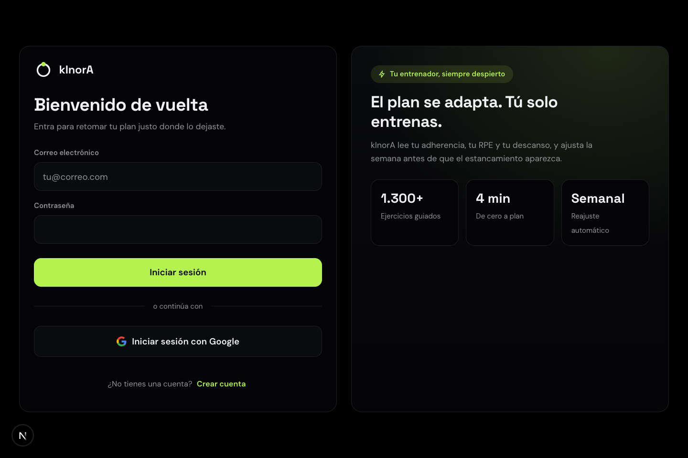

Tras iniciar sesión, la barra lateral izquierda es tu navegación permanente: **Panel**, **Plan**, **Planes**, **Estadísticas**, **Historial**, **Crear plan**, **Ejercicios**, **Memoria** y **Facturación**. Algunas entradas adicionales aparecen según tu perfil: **Clientes** si eres entrenador, **Marca** si gestionas un gimnasio.

---

## 2. Usuario: entrenar con kInorA

### 2.1 El Panel, tu centro de entrenamiento

Al entrar aterrizas en el **Panel**: la sesión recomendada de hoy (con duración y volumen previstos), tu *readiness*, la racha activa, el progreso de la semana y la ruta de carga semanal. El bloque **Coach AI** te propone ajustes concretos — aplícalos o descártalos con un clic.

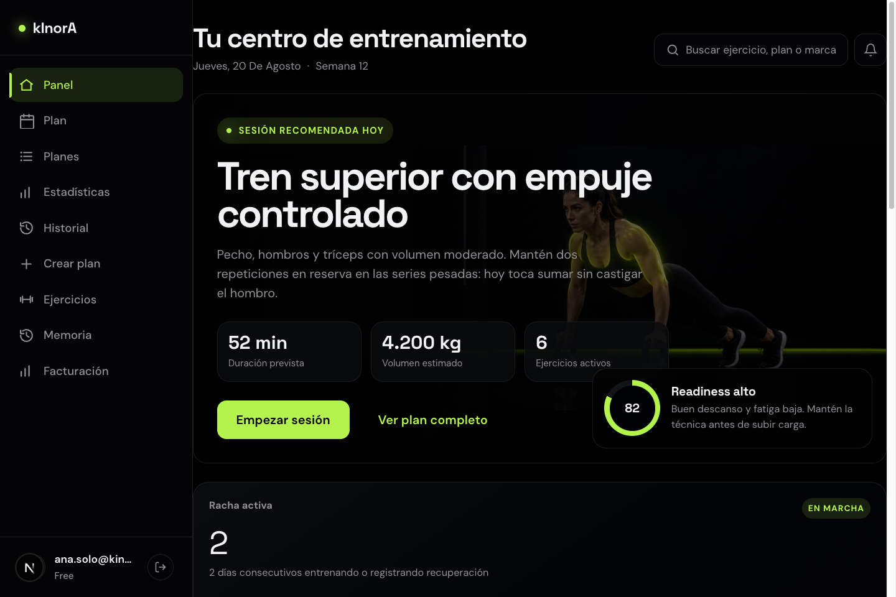

- **Empezar sesión** te lleva directamente al entrenamiento de hoy.
- El plan semanal muestra qué toca cada día (Empuje, Tracción, Pierna…).

### 2.2 El plan semanal

En **Plan** ves la semana completa: cada día con su estado (completado, pendiente, descanso) y el detalle de la sesión. Desde aquí se inicia el registro de un entrenamiento.

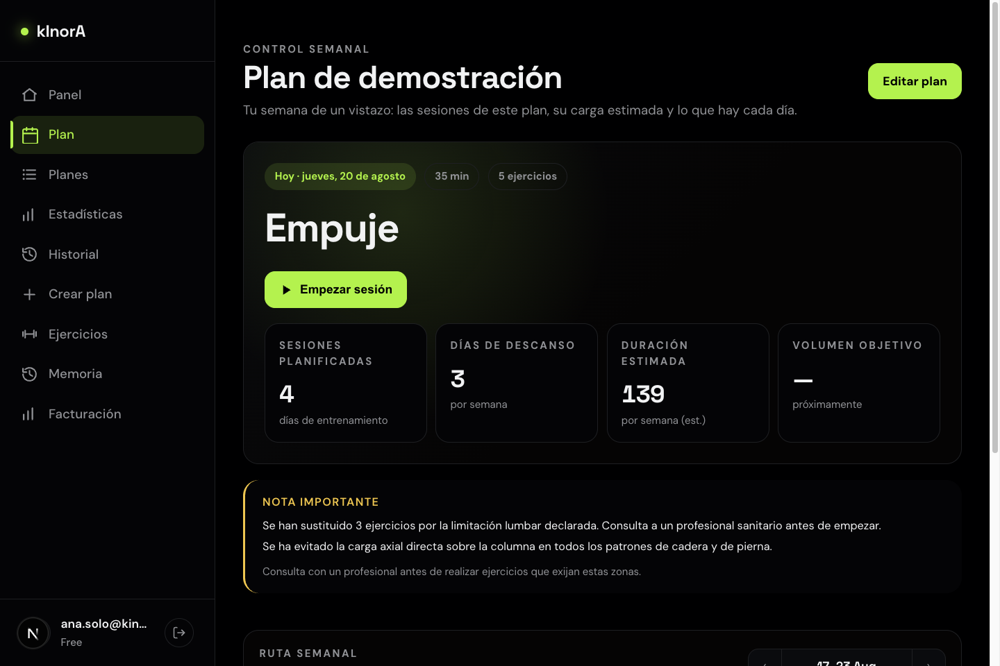

### 2.3 Estadísticas

**Estadísticas** resume tu progreso con selector de periodo (**Semana / Mes / Año**): volumen total con comparación al periodo anterior, sesiones, tiempo total, récords personales (1RM estimado por ejercicio y su tendencia), tendencia de volumen y distribución por grupo muscular. Cada récord enlaza al historial del ejercicio.

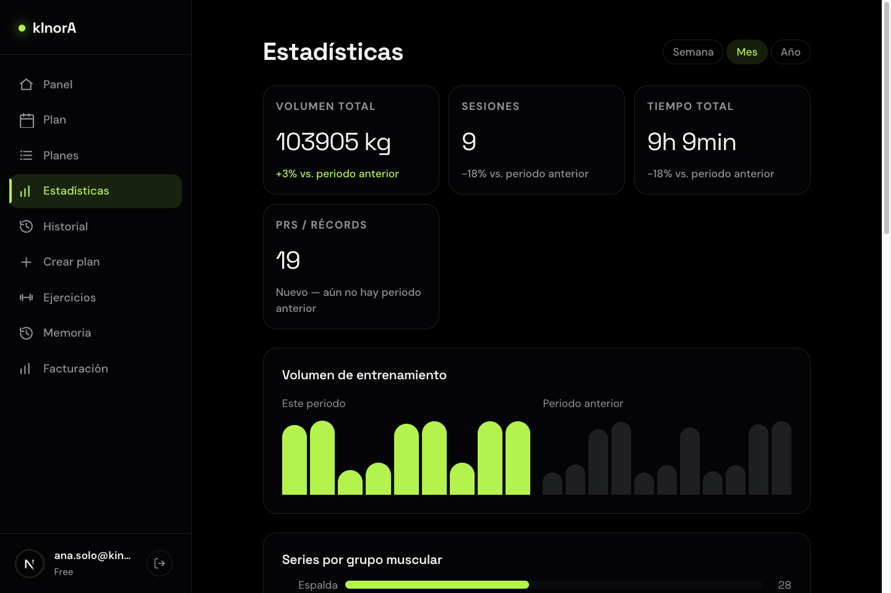

### 2.4 Historial y Ejercicios

- **Historial**: todas tus sesiones completadas, con volumen y RPE medio de cada una.
- **Ejercicios**: la biblioteca de ejercicios guiados, con búsqueda.

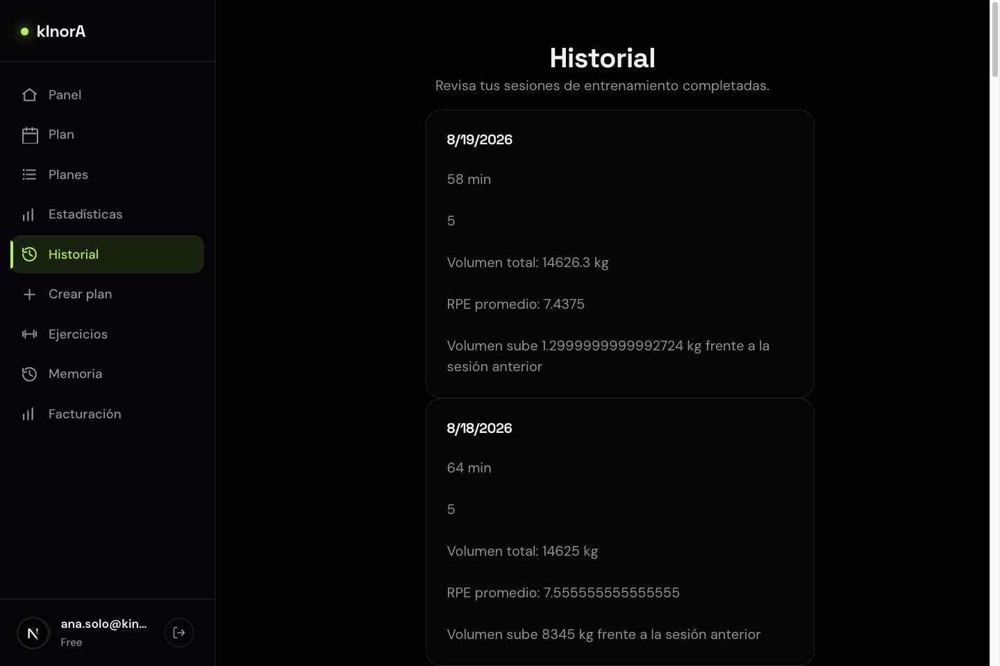

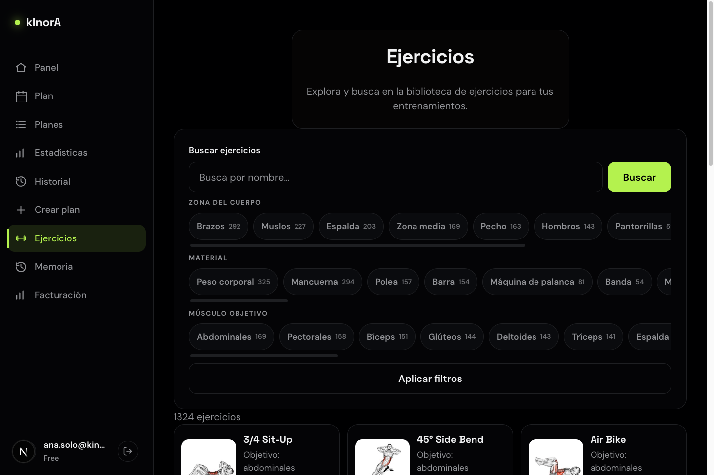

### 2.5 Crear un plan

**Crear plan** abre el asistente de seis pasos: objetivo, días por semana, duración de sesión, lugar de entrenamiento, material disponible y limitaciones físicas. Con eso kInorA genera un plan adaptado; si declaras una limitación (por ejemplo, lumbar), el plan sustituye los ejercicios de riesgo y te lo indica.

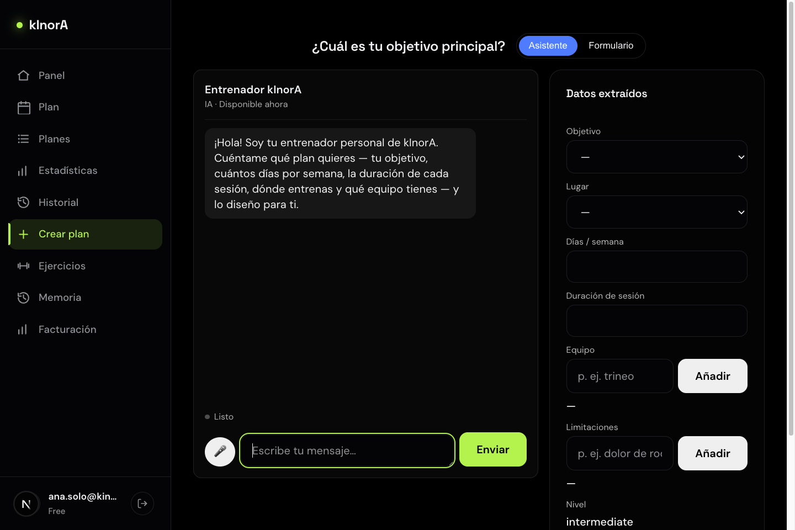

### 2.6 Perfil y facturación

- **Perfil**: tu nombre, objetivo, nivel de experiencia y datos corporales (altura, serie de peso).
- **Facturación**: tu plan actual (Free o Pro) y la mejora a Pro, que desbloquea el chat interactivo con el coach, la voz y límites ampliados.

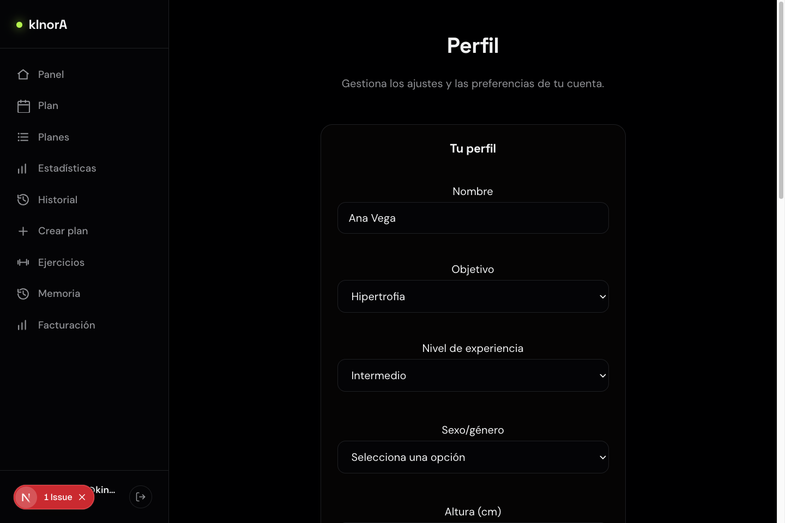

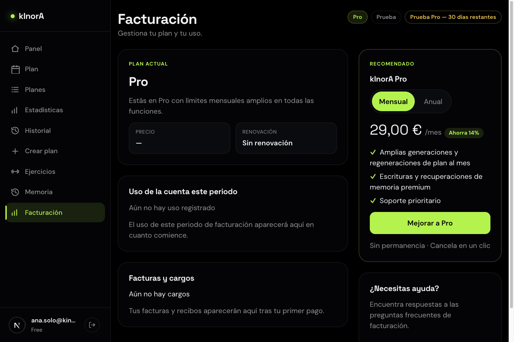

---

## 3. Entrenador: gestionar tu cartera de clientes

Una cuenta de entrenador ve todo lo anterior **más** la entrada **Clientes** en la navegación. El rol de entrenador lo activa el administrador de la plataforma; al concederlo, la entrada aparece automáticamente.

### 3.1 El espacio de clientes

**Clientes** es tu espacio de trabajo a dos columnas: a la izquierda **tu cartera** — con buscador, contador y filtros *Todos / Activo / Invitado* — y a la derecha el **detalle del cliente seleccionado**. Cada fila muestra el nombre, el correo, cuándo entrenó por última vez y su **adherencia de los últimos 28 días**, junto al estado de la invitación.

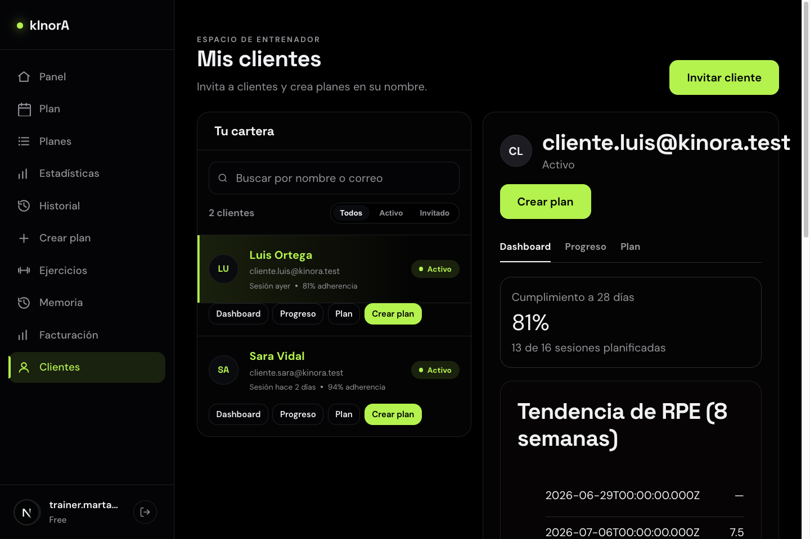

Cada cliente tiene cuatro accesos rápidos: **Dashboard**, **Progreso**, **Plan** y **Crear plan** (los dos últimos se activan cuando el cliente acepta la invitación).

### 3.2 El detalle del cliente

El panel derecho tiene tres pestañas:

- **Dashboard**: cumplimiento a 28 días, tendencia de RPE de las últimas 8 semanas y sesiones recientes con volumen y RPE.
- **Progreso**: las mismas estadísticas que ve el cliente — KPIs con selector Semana/Mes/Año, tendencia de volumen, series por grupo muscular y la tabla de récords personales; cada récord enlaza al historial de ese ejercicio.
- **Plan**: el tablero semanal del cliente, con lo planificado frente a lo realizado y navegación entre semanas.

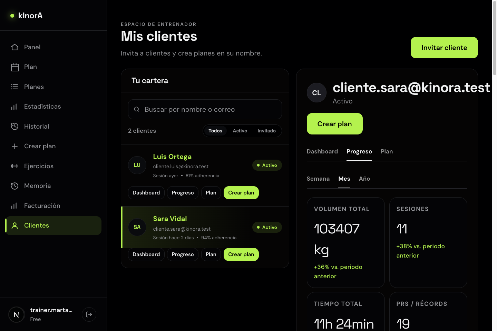

### 3.3 Invitar a un cliente

El botón **Invitar cliente** abre una ventana donde introduces el correo del cliente. La invitación es personal a ese correo — no se genera ningún enlace para compartir. El cliente debe tener cuenta en kInorA; cuando acepte la invitación pasará de *Invitado* a *Activo* y podrás ver su progreso y crearle planes.

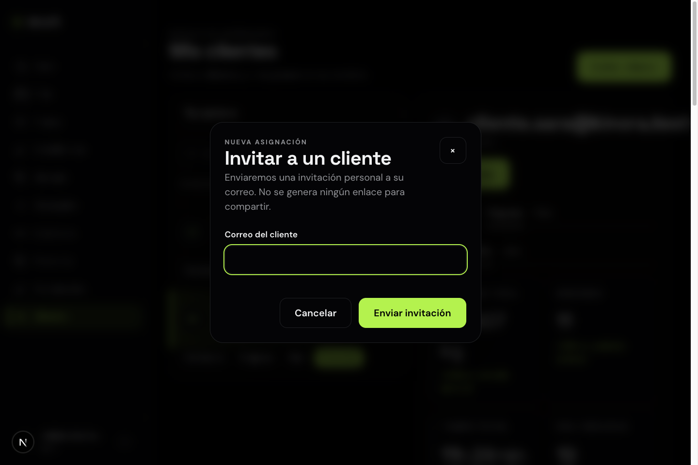

### 3.4 Crear un plan para un cliente

Desde la ficha del cliente (o su acceso rápido), **Crear plan** abre el formulario directo: objetivo, días por semana, duración, lugar y material. El plan generado pertenece al cliente — él lo ve y lo entrena como cualquier plan propio, y tú sigues su adherencia desde tu espacio.

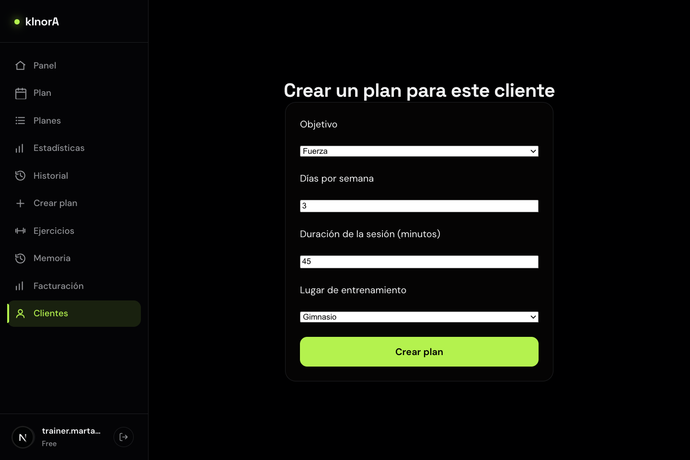

### 3.5 En el móvil

En la app móvil, el menú de inicio de una cuenta de entrenador muestra las entradas **Clientes** (lista, invitación y creación de planes) y **Plan de entrenador**. Estas entradas solo aparecen si tu cuenta de entrenador está activa y al corriente.

---

## 4. Gimnasio: tu marca, tus socios

Una cuenta de gimnasio añade la entrada **Marca** a la navegación: el **Estudio de marca** con el que personalizas la experiencia de tus socios.

### 4.1 Estudio de marca

En **Marca** configuras:

- **Subdominio**: la dirección de acceso de tus socios (por ejemplo, `norte.kinora.aitsai.com`).
- **Logotipo**: PNG, JPEG, SVG o WebP de hasta 5 MB.
- **Paleta**: colores de acento, superficie y texto.

La **vista previa en tiempo real** de la derecha muestra cómo verán tus socios la aplicación con tu identidad antes de guardar nada.

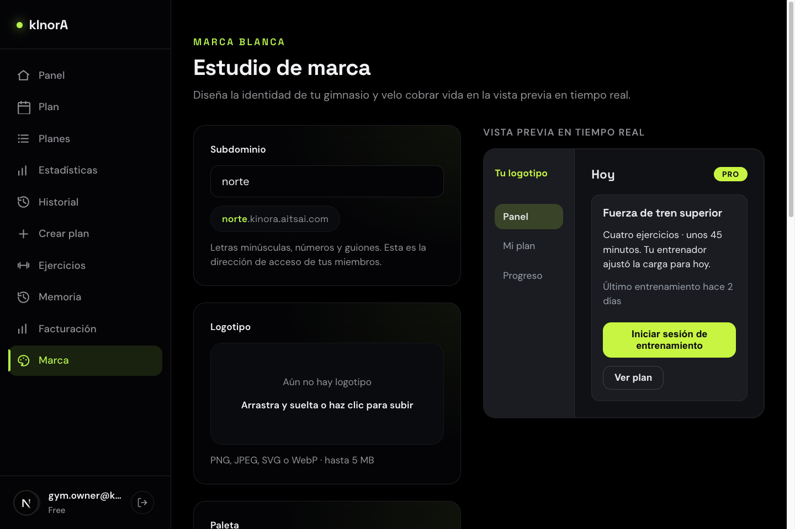

Cuando un socio entra por el subdominio del gimnasio, toda la aplicación se muestra con la marca configurada.

### 4.2 Facturación del gimnasio

**Facturación** muestra el plan del gimnasio y su estado. El plan de gimnasio escala por número de plazas (socios).

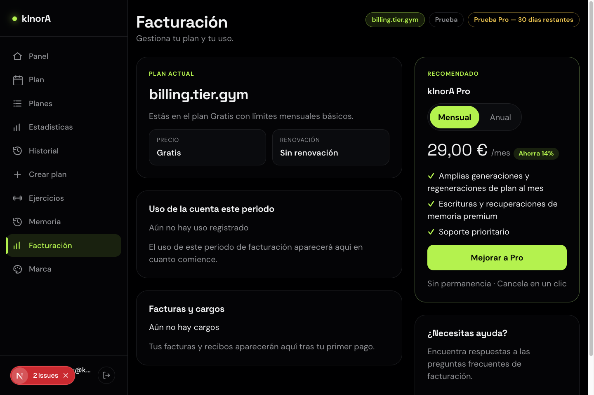

### 4.3 Socios y entrenadores del gimnasio

Los socios del gimnasio usan la aplicación como cualquier usuario (sección 2), con la marca del gimnasio. La gestión completa de la organización — alta de socios por el propio gimnasio y entrenadores de plantilla dentro del gimnasio — está en desarrollo; hoy los socios se registran con su cuenta y acceden por el subdominio del gimnasio.

---

## 5. Cuentas de prueba

Contraseña de todas las cuentas: `Kinora.Test.2026!`

| Cuenta | Correo | Perfil |
|---|---|---|
| Ana Vega | `ana.solo@kinora.test` | Usuaria independiente, con plan e historial de 6 semanas |
| Marta | `trainer.marta@kinora.test` | Entrenadora con dos clientes activos |
| Luis Ortega | `cliente.luis@kinora.test` | Cliente de Marta (81 % de adherencia) |
| Sara Vidal | `cliente.sara@kinora.test` | Cliente de Marta (94 % de adherencia) |
| Gimnasio | `gym.owner@kinora.test` | Cuenta de gimnasio con marca "norte" configurada |
| Entrenador de gimnasio | `gym.trainer@kinora.test` | Miembro del gimnasio (rol de plantilla, en desarrollo) |
| Socio | `gym.socio@kinora.test` | Socio del gimnasio |

Para levantar el entorno local: `podman machine start && podman start kinora-postgres`, y `pnpm dev` desde la raíz del repositorio (la web queda en el puerto 3000, o el siguiente libre si está ocupado).
