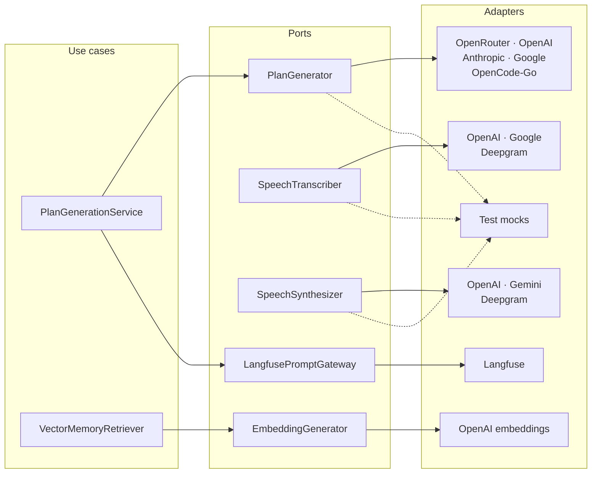
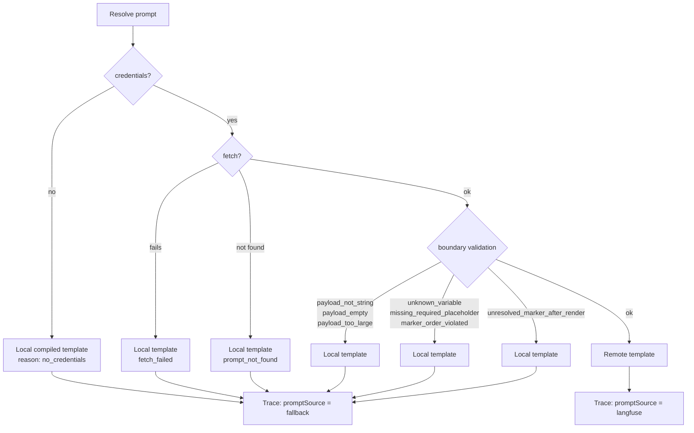
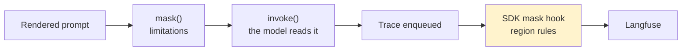

# The AI layer

> 🇪🇸 [Versión en español](./ai-layer_ES.md)

`apps/api/src/ai/` is thirty-seven files. Not thirty-seven files of API calls: a ports-and-adapters layer with five generation providers, three transcription providers, three synthesis providers, remote prompt management, a shared retry policy and two distinct mechanisms for redacting sensitive data.

This document explains why all of that is needed.

---

## 1. The problem

A product that generates training plans with a language model runs into four things a direct integration doesn't solve.

Providers change. Prices change, quality changes, a provider goes away, or a better one simply shows up. If the provider is welded into the code, switching is a release.

The prompt changes more often than the code does. Tweaking the instruction that produces the plan shouldn't require compiling, deploying and waiting.

The data is sensitive. Users declare injuries and medical conditions, and the system knows their weight and height. None of that can end up in a third-party observability dashboard — and yet the model does need to see it to do its job.

And models fail in strange ways. They return invalid JSON, they run out of quota, the provider throws a passing 503. Each of those failures calls for a different response.

---

## 2. Ports

Every capability is defined as a minimal interface on the inside, and the adapters live at the edge.

| Port | Contract |
|---|---|
| `PlanGenerator` | `generate(spec) → WorkoutProgram` |
| `PlanSpecExtractor` | `streamReply(input, signal)` as an async iterable, plus `extract(...)` |
| `EmbeddingGenerator` | `generate(input) → number[]` |
| `SpeechTranscriber` | `transcribe(input, signal) → TranscribeResult` |
| `SpeechSynthesizer` | `synthesize(text, signal) → SynthesizeResult` |
| `LangfusePromptGateway` | `fetchPrompt(name, label) → { template, version }` |
| `MemoryRetrievalEntitlementPort` | billing gate for premium memory |

The last one deserves a note. It's a narrow port whose only reason to exist is to keep the billing use case **out of** the AI layer. The alternative — querying billing directly from the generator — would have been shorter, and would have tied together two areas that have no business knowing about each other.

---

## 3. Provider matrix

| Capability | Options | Selected by | Default |
|---|---|---|---|
| Plan generation | OpenRouter, OpenAI, Anthropic, Google, OpenCode-Go | the `ai_provider_config` table, editable at `/admin/ai-config` | OpenRouter |
| Transcription | OpenAI, Google (Gemini), Deepgram | `VOICE_STT_PROVIDER` | OpenAI |
| Synthesis | OpenAI, Gemini, Deepgram | `VOICE_TTS_PROVIDER` | OpenAI |
| Embeddings | configurable by provider, model, version and dimension | `VECTOR_MEMORY_EMBEDDING_*` | OpenAI, `text-embedding-3-small`, 1536 |

The two selection axes are deliberately different. The generation provider is a product decision, made live from a dashboard and stored in the database. The voice provider is a deployment decision that lives in the environment, because changing it per tenant makes no sense. Transcription and synthesis are chosen **independently**, so a deployment can transcribe with Deepgram and synthesize with OpenAI.

API keys are never stored in the database and never shown in the UI. Only the active provider's key is needed.

Three rules common to every generation adapter, written down as a contract in `adapter-factory.ts`:

None of them throws at construction time even when the key is missing, because the key is read at call time. That lets the application boot with unconfigured providers, and makes building an adapter free and network-free.

They all use `withStructuredOutput` with the program schema in `jsonSchema` mode, not function calling. Hence the documented requirement that the chosen model support schema-based structured output; models that only do function calling fail at generation.

And they all mask the limitations text before the prompt ever reaches LangChain or Langfuse.

There are mock adapters as well. The unit test suite uses `MockPlanGenerator` and calls no provider at all, which means tests run without keys, without network and without cost.

---

## 4. Transient failures

The Google and Gemini REST adapters share a retry policy defined exactly once in `retry-transient.ts`, rather than duplicated per adapter.

Statuses 429, 500, 502, 503 and 504 count as transient. Up to two retries, three attempts in total, with fixed waits of 400 and 800 milliseconds and no jitter. And only **the response status is inspected, never the body**, which keeps the policy decoupled from each provider's particular shape.

The reason is written in the code, and it's concrete: Gemini's free tier returns 429 or 503 intermittently for a moment, and without this a single blip would take down an entire voice turn.

---

## 5. Remote prompt management

Three prompts live outside the code: `kinora-plan-generation`, `kinora-chat-reply` and `kinora-chat-extraction`. They're resolved at runtime from Langfuse under the fixed `production` label, with an in-process cache whose lifetime is controlled by `LANGFUSE_PROMPT_CACHE_TTL_MS`, sixty seconds by default.

Promoting a new version to `production` from the Langfuse UI is the only gate. No environment variable, no deploy, no code change.

That opens an obvious risk: whoever edits the prompt can break it. The answer is boundary validation with ten typed rejection reasons.

The fallback is always to the compiled template, never to an error. A Langfuse outage, a missing prompt or a badly edited template degrades prompt quality, not product availability. And every trace records in `promptSource` whether the remote or the local template was served, so the degradation is visible rather than silent.

There's one nuance that gives away the care taken here: a variable the template doesn't render is **not** grounds for rejection, because it may be a deliberate choice by whoever wrote the prompt. What does get rejected is an unknown variable, a missing required marker, an invalid marker order, or an unresolved `{{` after rendering.

There's also a drift signal, `prompt.template_drift`, reported as an observability event when the remote template diverges from what's expected. It's optional: with no consumer for the event, resolution behaves exactly the same.

Until all three prompts exist in the Langfuse project under `production`, what gets served is the local template with reason `prompt_not_found`. That's a stable, tested state, not a malfunction.

---

## 6. Privacy in traces

This is the finest part of the design, and the hardest one to reinvent.

There are two classes of sensitive data, and they **do not admit the same treatment**.

**Physical limitations** are masked with `mask()` over the string handed to `invoke()`. It's a pure function that replaces each declared term with `[REDACTED]`, literally and case-sensitively. Since it operates on the very string the model reads, the model loses those terms too, and the product accepts that cost.

**Body metrics** can't be treated that way. Masking them before `invoke()` would take them away from the model as well, which is precisely the opposite of the point of feeding them into generation. Here the model's input and the trace's input have to **diverge**, and the only place where that's possible is the `mask` hook in Langfuse's own SDK, supplied when constructing the `CallbackHandler`.

The verification that this hook does the job is annotated in the code: in the installed package, `LangfuseCoreOptions.mask` is applied only to `input` and `output`, in process, at enqueue time and before any network call, and it **fails closed** on an exception, replacing the entire payload rather than letting a partial value escape.

The implementation isn't a list of values but a rule engine over delimited regions. A rule names a zone of the prompt text — say `<body_profile>…</body_profile>` — whose contents must never reach a trace, whatever those contents happen to be. A value list would need to know each request's data; a region rule needs no context at all, it's a pure transformation over whatever the model received.

The design proved its worth when case `#374` showed up, limitations text leaking into the trace by another route: it was fixed by adding two entries, `<user_message>` and `<assistant_reply>`, without touching the engine, the handler or any adapter.

---

## 7. Vector memory

Memory retrieval is a premium capability, and the design carefully separates two things that look alike but aren't.

If the tenant isn't entitled, the `memory_retrieval` feature limit is zero, the gate denies, and retrieval **is skipped entirely before embedding or searching**. If the tenant is entitled and retrieval fails for a technical reason, then it does fail open and generation continues without memory.

The sentence that sums it up is right there in the code: a denial is a product decision and can never be used as failure recovery.

Cohort compatibility is the other piece of care. Each row stores the provider, model, version and dimension it was embedded with. If the current configuration doesn't match, those rows are deliberately skipped on retrieval. Changing the embedding model without re-embedding corrupts nothing: it makes part of the memory stop answering, explicitly and reversibly.

---

## 8. What this buys

Switching generation providers is one click in a dashboard. Changing the prompt is promoting a version in Langfuse. Changing the voice engine is an environment variable. A provider blip doesn't take down a voice turn. A Langfuse outage doesn't stop plans from being generated. And no health data reaches a third-party dashboard, even though the model does see it.

None of those properties come out of calling an API. They come out of having put a port where one belonged.
