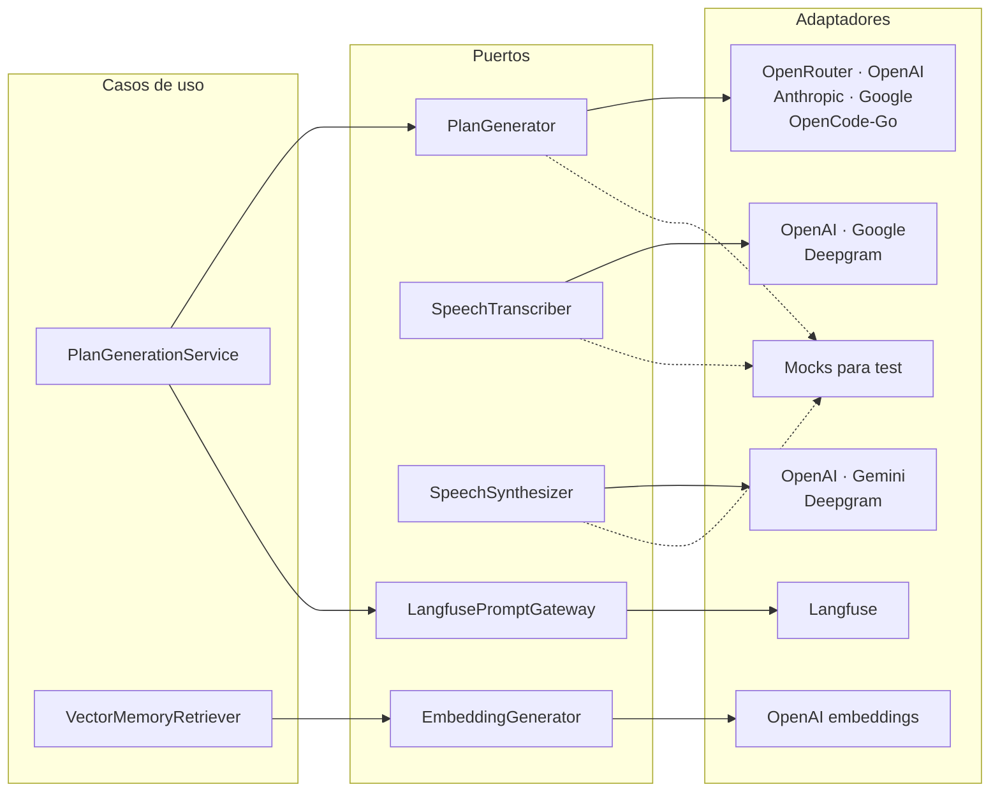
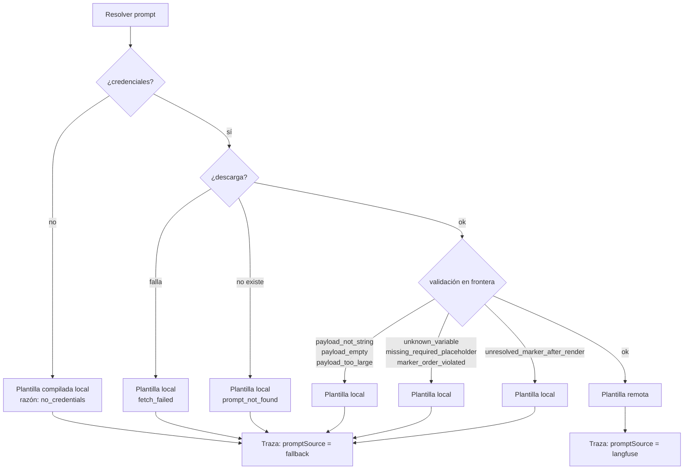
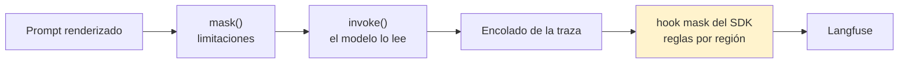

# La capa de IA

> 🇬🇧 [English version](./ai-layer.md)

`apps/api/src/ai/` son treinta y siete ficheros. No son treinta y siete ficheros de llamadas a una API: son una capa de puertos y adaptadores con cinco proveedores de generación, tres de transcripción, tres de síntesis, gestión remota de prompts, política de reintento compartida y dos mecanismos distintos de redacción de datos sensibles.

Este documento explica por qué hace falta todo eso.

---

## 1. El problema

Un producto que genera planes de entrenamiento con un modelo de lenguaje se enfrenta a cuatro cosas que una integración directa no resuelve.

El proveedor cambia. Cambia de precio, cambia de calidad, deja de estar disponible, o simplemente aparece uno mejor. Si el proveedor está soldado al código, cambiarlo es una release.

El prompt cambia más a menudo que el código. Ajustar la instrucción que produce el plan no debería requerir compilar, desplegar y esperar.

Los datos son sensibles. El usuario declara lesiones y patologías, y el sistema conoce su peso y su altura. Nada de eso puede acabar en un panel de observabilidad de terceros, y sin embargo el modelo sí necesita verlo para hacer su trabajo.

Y el modelo falla de formas raras. Devuelve JSON inválido, se queda sin cuota, el proveedor da un 503 pasajero. Cada uno de esos fallos exige una respuesta distinta.

---

## 2. Puertos

Cada capacidad se define como una interfaz mínima en el interior, y los adaptadores viven en el borde.

| Puerto | Contrato |
|---|---|
| `PlanGenerator` | `generate(spec) → WorkoutProgram` |
| `PlanSpecExtractor` | `streamReply(input, signal)` como iterable asíncrono, más `extract(...)` |
| `EmbeddingGenerator` | `generate(input) → number[]` |
| `SpeechTranscriber` | `transcribe(input, signal) → TranscribeResult` |
| `SpeechSynthesizer` | `synthesize(text, signal) → SynthesizeResult` |
| `LangfusePromptGateway` | `fetchPrompt(name, label) → { template, version }` |
| `MemoryRetrievalEntitlementPort` | puerta de facturación para la memoria premium |

El último merece una nota. Es un puerto estrecho cuya única razón de existir es que el caso de uso de facturación **no entre** en la capa de IA. La alternativa —consultar la facturación directamente desde el generador— habría sido más corta y habría atado dos áreas que no tienen por qué conocerse.

---

## 3. Matriz de proveedores

| Capacidad | Opciones | Selección | Por defecto |
|---|---|---|---|
| Generación de plan | OpenRouter, OpenAI, Anthropic, Google, OpenCode-Go | tabla `ai_provider_config`, editable en `/admin/ai-config` | OpenRouter |
| Transcripción | OpenAI, Google (Gemini), Deepgram | `VOICE_STT_PROVIDER` | OpenAI |
| Síntesis | OpenAI, Gemini, Deepgram | `VOICE_TTS_PROVIDER` | OpenAI |
| Embeddings | configurable por proveedor, modelo, versión y dimensión | `VECTOR_MEMORY_EMBEDDING_*` | OpenAI, `text-embedding-3-small`, 1536 |

Los dos ejes de selección son deliberadamente distintos. El proveedor de generación es una decisión de producto que se toma en caliente desde un panel y se guarda en base de datos. El de voz es una decisión de despliegue que vive en el entorno, porque no tiene sentido cambiarla por tenant. Transcripción y síntesis se eligen **por separado**, de modo que un despliegue puede transcribir con Deepgram y sintetizar con OpenAI.

Las claves de API nunca se guardan en base de datos ni se muestran en la interfaz. Solo hace falta la del proveedor activo.

Tres reglas comunes a todos los adaptadores de generación, escritas como contrato en `adapter-factory.ts`:

Ninguno lanza al construirse aunque falte la clave, porque la clave se lee en el momento de la llamada. Eso permite arrancar la aplicación con proveedores no configurados y hace que construir un adaptador sea gratis y sin red.

Todos usan `withStructuredOutput` con el esquema del programa en modo `jsonSchema`, no llamada a función. De ahí sale el requisito documentado de que el modelo elegido soporte salida estructurada por esquema; los que solo admiten function-calling fallan en generación.

Y todos enmascaran el texto de limitaciones antes de que el prompt llegue a LangChain o a Langfuse.

Existen además adaptadores simulados. La suite de tests unitarios usa `MockPlanGenerator` y no llama a ningún proveedor, lo que hace que los tests corran sin claves, sin red y sin coste.

---

## 4. Fallos transitorios

Los adaptadores REST de Google y Gemini comparten una política de reintento definida una sola vez en `retry-transient.ts`, en lugar de duplicarla por adaptador.

Se consideran transitorios los estados 429, 500, 502, 503 y 504. Hay hasta dos reintentos, tres intentos en total, con esperas fijas de 400 y 800 milisegundos, sin aleatorización. Y solo se inspecciona **el estado de la respuesta, nunca el cuerpo**, lo que mantiene la política desacoplada de la forma concreta de cada proveedor.

El motivo está escrito en el código y es concreto: el nivel gratuito de Gemini devuelve 429 o 503 de forma intermitente durante un instante, y sin esto un parpadeo tumbaba el turno de voz entero.

---

## 5. Gestión remota de prompts

Tres prompts viven fuera del código: `kinora-plan-generation`, `kinora-chat-reply` y `kinora-chat-extraction`. Se resuelven en ejecución desde Langfuse bajo la etiqueta fija `production`, con una caché en proceso cuyo tiempo de vida controla `LANGFUSE_PROMPT_CACHE_TTL_MS`, sesenta segundos por defecto.

Promocionar una versión nueva a `production` desde la interfaz de Langfuse es la única puerta. No hace falta variable de entorno, ni despliegue, ni cambio de código.

Eso abre un riesgo evidente: quien edita el prompt puede romperlo. La respuesta es una validación en frontera con diez motivos de rechazo tipados.

La caída es siempre hacia la plantilla compilada, nunca hacia el error. Una caída de Langfuse, un prompt inexistente o una plantilla mal editada degradan la calidad del prompt, no la disponibilidad del producto. Y cada traza registra en `promptSource` si sirvió la remota o la local, así que la degradación es visible en lugar de silenciosa.

Hay un matiz que revela cuidado: una variable que la plantilla no renderiza **no** es motivo de rechazo, porque puede ser una decisión deliberada de quien escribe el prompt. Lo que sí se rechaza es una variable desconocida, la ausencia de un marcador obligatorio, un orden de marcadores inválido, o un `{{` sin resolver después de renderizar.

Además existe una señal de deriva, `prompt.template_drift`, que se reporta como evento de observabilidad cuando la plantilla remota se aparta de lo esperado. Es opcional: si no hay consumidor del evento, la resolución se comporta exactamente igual.

Hasta que los tres prompts existan en el proyecto de Langfuse bajo `production`, lo que se sirve es la plantilla local con razón `prompt_not_found`. Es un estado estable y probado, no una avería.

---

## 6. Privacidad en las trazas

Esta es la parte más fina del diseño, y la que más difícil sería reinventar.

Hay dos clases de dato sensible y **no admiten el mismo tratamiento**.

Las **limitaciones físicas** se enmascaran con `mask()` sobre la cadena que se entrega a `invoke()`. Es una función pura que sustituye cada término declarado por `[REDACTED]` de forma literal y sensible a mayúsculas. Como opera sobre la misma cadena que lee el modelo, el modelo también pierde esos términos, y el producto acepta ese coste.

Las **métricas corporales** no admiten ese trato. Enmascararlas antes de `invoke()` las quitaría también al modelo, que es justo lo contrario de lo que se busca al alimentarlas en la generación. Aquí la entrada del modelo y la entrada de la traza tienen que **divergir**, y el único punto donde eso es posible es el hook `mask` del propio SDK de Langfuse, que se suministra al construir el `CallbackHandler`.

La verificación de que ese hook sirve está anotada en el código: en el paquete instalado, `LangfuseCoreOptions.mask` se aplica solo a `input` y `output`, en proceso, en el momento de encolar y antes de cualquier llamada de red, y **falla cerrado** ante una excepción, sustituyendo la carga entera en lugar de dejar escapar un valor parcial.

La implementación no es una lista de valores sino un motor de reglas por región delimitada. Una regla nombra una zona del texto del prompt, por ejemplo `<body_profile>…</body_profile>`, cuyo contenido no debe llegar nunca a una traza sea cual sea ese contenido. Una lista de valores necesitaría conocer los datos de cada petición; una regla de región no necesita contexto alguno, es una transformación pura sobre lo que el modelo recibió.

El diseño demostró su valor cuando apareció el caso `#374`, texto de limitaciones colándose en la traza por otra vía: se resolvió añadiendo dos entradas, `<user_message>` y `<assistant_reply>`, sin tocar el motor, ni el handler, ni ningún adaptador.

---

## 7. Memoria vectorial

La recuperación de memoria es una capacidad premium, y el diseño distingue con cuidado dos cosas que se parecen y no lo son.

Si el tenant no tiene derecho, el límite de la característica `memory_retrieval` es cero, la puerta deniega y la recuperación **se omite entera antes de embeber o buscar**. Si el tenant sí tiene derecho y la recuperación falla por una razón técnica, entonces sí se falla en abierto y la generación continúa sin memoria.

La frase que lo resume está en el código: una denegación es una decisión de producto y no puede usarse nunca como recuperación ante fallo.

La compatibilidad de cohortes es el otro cuidado. Cada fila almacena el proveedor, el modelo, la versión y la dimensión con que fue embebida. Si la configuración vigente no coincide, esas filas se omiten deliberadamente al recuperar. Cambiar de modelo de embeddings sin re-embeber no corrompe nada: hace que una parte de la memoria deje de responder, de forma explícita y reversible.

---

## 8. Lo que esto compra

Cambiar de proveedor de generación es un clic en un panel. Cambiar el prompt es promocionar una versión en Langfuse. Cambiar el motor de voz es una variable de entorno. Un parpadeo del proveedor no tumba un turno de voz. Una caída de Langfuse no impide generar planes. Y ningún dato de salud llega a un panel de terceros aunque el modelo sí lo vea.

Ninguna de esas propiedades sale de llamar a una API. Salen de haber puesto un puerto donde tocaba.
