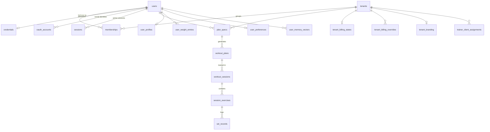

# Data model

> 🇪🇸 [Versión en español](./data-model_ES.md)

Drizzle schema in `apps/api/src/db/schema.ts`, with 31 migrations applied. **Twenty-nine tables and twenty enumerated types**, eighteen of which are tenant-scoped.

Everything below is taken from the real schema, not from an earlier diagram.

---

## 1. Overview

---

## 2. Identity and tenancy

`tenants` and `users` are deliberately thin: four and five columns. Everything else hangs off them.

The relationship is `memberships`, with `role` and `status` typed as enumerations and a unique index on the tenant-user pair. That table is what makes it possible for the same email address to belong to several organisations, which is the premise behind the Trainer tier and the B2B offering.

Credentials are kept separate from the user, and separate from each other by method. `credentials` stores nothing but `password_hash`, with a unique index per user. `oauth_accounts` stores `provider_id`, `provider_account_id` and `email`, with a unique index on provider and email that is precisely the automatic account linking mechanism: someone signing in with Google using an address already registered with a password lands on the same user instead of creating a duplicate.

`sessions` stores `token_hash`, never the token itself. It carries `tenant_id` alongside `user_id`, so a session identifies not only the person but the organisation they are currently operating in.

## 3. Planning

A plan's journey runs through three tables, and the design deliberately separates what the user asks for from what the AI produces.

`plan_drafts` is the assistant's draft, with `step`, `spec_json` and a `version` for concurrency control, plus a unique index per tenant and user: there is only ever one live draft at a time.

`plan_specs` is the confirmed request. It stores `spec_json` and the `confirmed` boolean. This is where declared physical limitations live, inside the JSON rather than as an entity of their own, because they describe a plan request and not a medical history.

`workout_plans` is the result. It has an enumerated `status`, `program_json`, `error_message` for failed generations, `archived_at` because plans are archived rather than deleted, and `version` as a monotonic integer witness for concurrent editing.

## 4. Workout logging

`workout_sessions` → `session_exercises` → `set_records` is a classic hierarchy, with two details that aren't.

The first is the `workout_sessions_single_active_per_user_unique` index: the database guarantees that a person cannot have two active sessions at once. It's a product invariant expressed as a constraint rather than as validation in the service, so no race condition can violate it.

The second is that `session_exercises` and `set_records` don't carry `tenant_id`. They hang off `workout_sessions`, which does, and isolation is inherited through the foreign key chain. It's consistent, and it avoids denormalising the tenant all the way down to the leaf.

`set_records` stores both `target_reps` and `actual_reps`, along with `weight_kg`, `rpe` and `completed`. That pairing of intent and reality is what later feeds adaptation by adherence and by RPE.

## 5. User context and memory

`user_profiles` carries `goal`, `experience_level`, `self_described_sex` and `height_cm`, the first three as enumerations. `user_weight_entries` is the body weight time series, indexed by user and record date, which is what makes body-weight-adjusted volume possible. `user_preferences` stores the assistant's default values and the voice synthesis toggle.

`user_memory_vectors` is the richest table in the schema, at twenty-two columns, and its shape tells a story. Alongside `summary` and the pgvector `embedding`, it stores `status`, `eligibility` and `consent_status` with their enumerations, plus `consented_at` and `revoked_at`: consent is a first-class piece of data, not a checkbox. It stores `idempotency_key` and `fingerprint` to avoid duplicating memories. And it stores `embedding_provider`, `embedding_model`, `embedding_version` and `embedding_dimension` on every row, which is what allows incompatible embedding cohorts to coexist: on retrieval, rows from a cohort that doesn't match the current configuration are deliberately skipped rather than returning meaningless results. It also has `disabled_at` and `deleted_at` — soft deletion with the option of temporary deactivation.

`vector_memory_settings` allows memory to be enabled or disabled per user within a tenant.

## 6. Billing

Six tables plus one for idempotency, and it's the part of the schema with the most work invested in correctness.

`tenant_billing_states` concentrates the state: `tier`, `status`, `source`, trial window, Stripe identifiers, cycle, `seat_count` and `stripe_event_ts`. That last field, together with the `stripe_processed_events` table indexed by `event_id`, solves the classic webhook problem: duplicate events and events that arrive out of order.

`tenant_billing_overrides` allows a tier to be granted manually for a limited window, with a unique `operation_key` so the same administrative operation isn't applied twice.

Quotas are four tables across two levels: `tenant_quota_counters` and `member_quota_counters` for consumption, `member_quota_allocations` for distribution, and `billing_usage_ledger` as the ledger, with a unique `operation_key`, `decision` and `member_counter_credited`. That last column exists so a consumed unit can be refunded correctly.

`billing_audit_events` records who did what to whom, with actor and subject kept separate.

## 7. Trainer, white label and observability

`trainer_client_assignments` links trainer and client within a tenant, with three indexes: uniqueness per tenant and client, uniqueness of the active assignment per client, and lookup by trainer.

`tenant_branding` stores the subdomain and six brand colours. `observability_events` collects the system's curated events, with `level`, `event`, `outcome` and `metadata`, plus three indexes designed for the admin view.

`ai_provider_config` is a single-row table holding the active provider and model. API keys are **not here**: they live in the operator's environment, never in the database or the UI.

---

## 8. Invariants expressed in the schema

This is worth pulling out separately, because it's a conscious and fairly unusual design decision: a good share of the rules don't live in the service, they live in the database as `CHECK` constraints.

Time windows validate themselves, with `trial_window_check` on the billing state and `active_window_check` on the overrides. The quota counters carry three constraints each: non-negative consumption, non-negative limit, and consumption within the limit. And each of the six brand colours carries its own hexadecimal format check.

The practical effect is that a service bug can't leave the database in an impossible state. The constraint rejects the write.

---

## 9. Reference table

| Table | Scope | Columns | Foreign keys |
|---|---|---:|---|
| `tenants` | — | 4 | — |
| `users` | — | 5 | — |
| `memberships` | tenant | 6 | tenants, users |
| `credentials` | — | 3 | users |
| `oauth_accounts` | — | 5 | users |
| `sessions` | tenant | 5 | users, tenants |
| `plan_drafts` | tenant | 7 | tenants, users |
| `plan_specs` | tenant | 6 | tenants, users |
| `workout_plans` | tenant | 12 | tenants, users, plan_specs |
| `workout_sessions` | tenant | 10 | tenants, users, workout_plans |
| `session_exercises` | inherited | 7 | workout_sessions |
| `set_records` | inherited | 9 | session_exercises |
| `user_profiles` | — | 8 | users |
| `user_weight_entries` | — | 5 | users |
| `user_preferences` | — | 7 | users |
| `user_memory_vectors` | tenant | 22 | tenants, users |
| `vector_memory_settings` | tenant | 7 | tenants, users |
| `tenant_billing_states` | tenant | 17 | tenants |
| `tenant_billing_overrides` | tenant | 10 | tenants, users |
| `tenant_quota_counters` | tenant | 9 | tenants |
| `member_quota_allocations` | tenant | 9 | users |
| `member_quota_counters` | tenant | 10 | — |
| `billing_usage_ledger` | tenant | 10 | — |
| `billing_audit_events` | tenant | 9 | users |
| `stripe_processed_events` | — | 4 | — |
| `trainer_client_assignments` | tenant | 7 | tenants, users |
| `tenant_branding` | tenant | 17 | tenants |
| `ai_provider_config` | — | 4 | — |
| `observability_events` | tenant | 8 | — |

The column counts include the `CHECK` constraints declared alongside them, which is how Drizzle expresses them.

Two things are left out of the schema by explicit decision: the **exercise catalogue**, which is the versioned `packages/exercise-catalog` package, so that the pattern taxonomy and the load-by-body-region matrix get reviewed as code, and **coupons**, which are Stripe objects applied at checkout with no table of their own on the platform.
