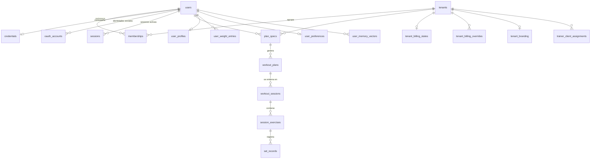

# Modelo de datos

> 🇬🇧 [English version](./data-model.md)

Esquema Drizzle en `apps/api/src/db/schema.ts`, con 31 migraciones aplicadas. **Veintinueve tablas y veinte tipos enumerados**, de las cuales dieciocho llevan ámbito de tenant.

Todo lo que sigue está extraído del esquema real, no de un diagrama previo.

---

## 1. Vista de conjunto

---

## 2. Identidad y tenancy

`tenants` y `users` son deliberadamente delgadas: cuatro y cinco columnas. Todo lo demás cuelga de ellas.

La relación es `memberships`, con `role` y `status` tipados por enumeración y un índice único sobre el par tenant-usuario. Esa tabla es la que hace posible que el mismo correo pertenezca a varias organizaciones, que es el supuesto del nivel Entrenador y del B2B.

Las credenciales están separadas del usuario y separadas entre sí por método. `credentials` guarda únicamente `password_hash` con índice único por usuario. `oauth_accounts` guarda `provider_id`, `provider_account_id` y `email`, con un índice único sobre proveedor y correo que es precisamente el mecanismo de vinculación automática de cuentas: quien entra con Google usando un correo ya registrado con contraseña aterriza en el mismo usuario en lugar de crear un duplicado.

`sessions` almacena `token_hash`, nunca el token. Lleva `tenant_id` además de `user_id`, de modo que la sesión no solo identifica a la persona sino la organización en la que está operando.

## 3. Planificación

El recorrido de un plan atraviesa tres tablas y el diseño separa a propósito lo que el usuario pide de lo que la IA produce.

`plan_drafts` es el borrador del asistente, con `step`, `spec_json` y una `version` para control de concurrencia, y un índice único por tenant y usuario: solo hay un borrador vivo a la vez.

`plan_specs` es la petición confirmada. Guarda `spec_json` y el booleano `confirmed`. Aquí es donde viven las limitaciones físicas declaradas, dentro del JSON y no como entidad propia, porque describen una petición de plan y no un historial clínico.

`workout_plans` es el resultado. Tiene `status` enumerado, `program_json`, `error_message` para las generaciones fallidas, `archived_at` porque los planes se archivan en lugar de borrarse, y `version` como testigo entero monótono para la edición concurrente.

## 4. Registro de entrenamiento

`workout_sessions` → `session_exercises` → `set_records` es una jerarquía clásica, con dos detalles que no lo son.

El primero es el índice `workout_sessions_single_active_per_user_unique`: la base de datos garantiza que una persona no puede tener dos sesiones activas a la vez. Es un invariante de producto expresado como restricción, no como validación en el servicio, así que ninguna condición de carrera puede violarlo.

El segundo es que `session_exercises` y `set_records` no llevan `tenant_id`. Cuelgan de `workout_sessions`, que sí lo lleva, y el aislamiento se hereda por la cadena de claves ajenas. Es coherente y evita desnormalizar el tenant hasta la hoja.

`set_records` guarda a la vez `target_reps` y `actual_reps`, además de `weight_kg`, `rpe` y `completed`. Esa pareja de objetivo y realidad es lo que alimenta después la adaptación por adherencia y por RPE.

## 5. Contexto del usuario y memoria

`user_profiles` lleva `goal`, `experience_level`, `self_described_sex` y `height_cm`, los tres primeros como enumeraciones. `user_weight_entries` es la serie temporal de peso, indexada por usuario y fecha de registro, que es lo que permite el volumen ajustado por peso corporal. `user_preferences` guarda los valores por defecto del asistente y el interruptor de síntesis de voz.

`user_memory_vectors` es la tabla más rica del esquema, con veintidós columnas, y su forma cuenta una historia. Además del `summary` y el `embedding` sobre pgvector, guarda `status`, `eligibility` y `consent_status` con sus enumeraciones, más `consented_at` y `revoked_at`: el consentimiento es un dato de primera clase, no una casilla. Guarda `idempotency_key` y `fingerprint` para no duplicar recuerdos. Y guarda `embedding_provider`, `embedding_model`, `embedding_version` y `embedding_dimension` en cada fila, que es lo que permite convivir con cohortes de embeddings incompatibles: al recuperar, las filas de una cohorte que no coincide con la configuración vigente se omiten deliberadamente en lugar de devolver resultados sin sentido. Tiene además `disabled_at` y `deleted_at`, o sea borrado lógico con posibilidad de desactivación temporal.

`vector_memory_settings` permite activar o desactivar la memoria por usuario dentro de un tenant.

## 6. Facturación

Seis tablas más una de idempotencia, y es la parte del esquema donde más trabajo hay invertido en corrección.

`tenant_billing_states` concentra el estado: `tier`, `status`, `source`, ventana de prueba, identificadores de Stripe, ciclo, `seat_count` y `stripe_event_ts`. Ese último campo, junto con la tabla `stripe_processed_events` indexada por `event_id`, resuelve el problema clásico de los webhooks: eventos duplicados y eventos que llegan desordenados.

`tenant_billing_overrides` permite conceder un nivel manualmente durante una ventana temporal, con `operation_key` único para que la misma operación administrativa no se aplique dos veces.

Las cuotas son cuatro tablas en dos niveles: `tenant_quota_counters` y `member_quota_counters` para el consumo, `member_quota_allocations` para el reparto, y `billing_usage_ledger` como libro mayor con `operation_key` único, `decision` y `member_counter_credited`. Esa última columna existe para poder devolver correctamente una unidad consumida.

`billing_audit_events` registra quién hizo qué a quién, con actor y sujeto separados.

## 7. Entrenador, marca blanca y observabilidad

`trainer_client_assignments` relaciona entrenador y cliente dentro de un tenant, con tres índices: unicidad por tenant y cliente, unicidad de asignación activa por cliente, y búsqueda por entrenador.

`tenant_branding` guarda el subdominio y seis colores de marca. `observability_events` recoge los eventos curados del sistema, con `level`, `event`, `outcome` y `metadata`, y tres índices pensados para la vista de administración.

`ai_provider_config` es una tabla de una sola fila con el proveedor y el modelo activos. Las claves de API **no están aquí**: viven en el entorno del operador y nunca en base de datos ni en la interfaz.

---

## 8. Invariantes expresados en el esquema

Vale la pena separarlo porque es una decisión de diseño consciente y poco habitual: buena parte de las reglas no viven en el servicio, viven en la base de datos como restricciones `CHECK`.

Las ventanas temporales se validan solas, con `trial_window_check` en el estado de facturación y `active_window_check` en las anulaciones. Los contadores de cuota llevan tres restricciones cada uno: consumo no negativo, límite no negativo y consumo dentro del límite. Y los seis colores de marca llevan cada uno su comprobación de formato hexadecimal.

El efecto práctico es que un error de servicio no puede dejar la base de datos en un estado imposible. La restricción rechaza la escritura.

---

## 9. Tabla de referencia

| Tabla | Ámbito | Columnas | Claves ajenas |
|---|---|---:|---|
| `tenants` | — | 4 | — |
| `users` | — | 5 | — |
| `memberships` | tenant | 6 | tenants, users |
| `credentials` | — | 3 | users |
| `oauth_accounts` | — | 5 | users |
| `sessions` | tenant | 5 | users, tenants |
| `plan_drafts` | tenant | 7 | tenants, users |
| `plan_specs` | tenant | 6 | tenants, users |
| `workout_plans` | tenant | 12 | tenants, users, plan_specs |
| `workout_sessions` | tenant | 10 | tenants, users, workout_plans |
| `session_exercises` | heredado | 7 | workout_sessions |
| `set_records` | heredado | 9 | session_exercises |
| `user_profiles` | — | 8 | users |
| `user_weight_entries` | — | 5 | users |
| `user_preferences` | — | 7 | users |
| `user_memory_vectors` | tenant | 22 | tenants, users |
| `vector_memory_settings` | tenant | 7 | tenants, users |
| `tenant_billing_states` | tenant | 17 | tenants |
| `tenant_billing_overrides` | tenant | 10 | tenants, users |
| `tenant_quota_counters` | tenant | 9 | tenants |
| `member_quota_allocations` | tenant | 9 | users |
| `member_quota_counters` | tenant | 10 | — |
| `billing_usage_ledger` | tenant | 10 | — |
| `billing_audit_events` | tenant | 9 | users |
| `stripe_processed_events` | — | 4 | — |
| `trainer_client_assignments` | tenant | 7 | tenants, users |
| `tenant_branding` | tenant | 17 | tenants |
| `ai_provider_config` | — | 4 | — |
| `observability_events` | tenant | 8 | — |

Los recuentos de columnas incluyen las restricciones `CHECK` declaradas junto a ellas, que es como las expresa Drizzle.

Fuera del esquema quedan dos cosas por decisión explícita: el **catálogo de ejercicios**, que es el paquete versionado `packages/exercise-catalog` para que la taxonomía de patrones y la matriz de carga por zona corporal se revisen como código, y los **cupones**, que son objetos de Stripe aplicados en el pago sin tabla propia en la plataforma.
