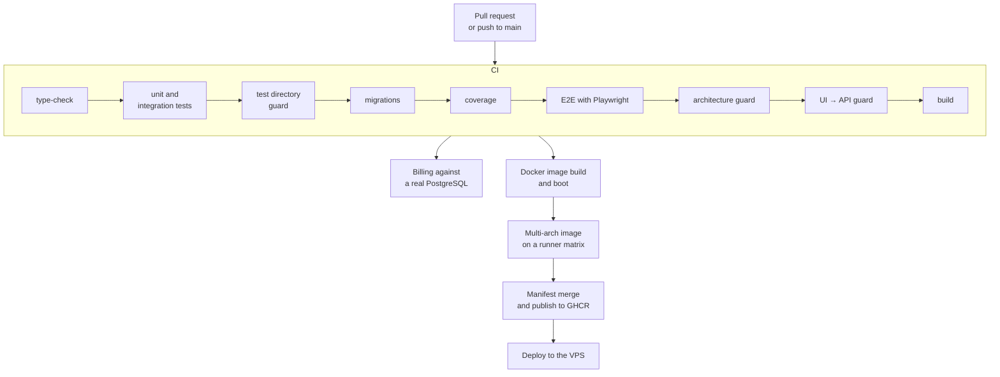

# Deployment and operations

> 🇪🇸 [Versión en español](./deployment_ES.md)

Everything below has been checked against `.github/workflows/ci-cd.yml`, `scripts/deploy.sh` and `docker-compose.yml`.

---

## 1. The pipeline

Nine checks inside the CI job, and three of them aren't the usual ones.

The **test directory guard** verifies that no test directory is left out of some vitest project. Without it, moving a file into a new folder silently drops it from the suite and nobody notices it stopped running.

The **architecture guard** runs `dependency-cruiser` plus a negative test that checks the rules fail when they're supposed to fail. It's a guard on the guard.

The **UI-against-API guard** cross-checks what the frontend consumes against what the API exposes, so a broken contract is caught in integration rather than in production.

Coverage, on top of that, has been measured against a real database since `#417` rather than a simulated one, so the number reflects what actually runs.

## 2. The image

The build is multi-arch across a runner matrix and finishes by merging the manifest and publishing it to GHCR. Before that there's a smoke test that builds the image, brings up Postgres, runs the migrations inside an ephemeral container, starts api and web and checks the health probe. If the application doesn't boot, there's no image.

## 3. The deploy

The deploy job starts by validating that every required secret exists, with a message that even tells you how to generate `VPS_KNOWN_HOSTS` with `ssh-keyscan`. Fail early, and with a useful instruction.

It then configures SSH with the host fingerprint pinned from `VPS_KNOWN_HOSTS` instead of trusting on first use, copies the necessary files and runs `scripts/deploy.sh` on the server.

The configuration travels as a base64-encoded payload rather than as arguments to the SSH command. The reason is written in the script: to avoid injection through the command line.

### The precedence that prevents a green deploy running an old image

This is the most interesting detail in the whole process, and it answers a real failure.

On the VPS there's an operator-managed `.env` that survives deploys and holds the runtime secrets. The script needs to load it so Compose can interpolate `${OPENROUTER_*}` and `${LANGFUSE_*}`. But if that file carelessly contains an `IMAGE_TAG` or a `GHCR_IMAGE` copied from somewhere else, loading it would overwrite the image the pipeline has just built.

The fix is to snapshot the pipeline-managed variables before loading the `.env` and restore them afterwards. Those are the image reference, the OAuth credentials, the API base URL and the public origin. The script also warns on stderr if it detects that the operator's `.env` defines any of them.

Without that precedence, a deploy could finish green while running an old image. That's exactly the kind of failure that never shows its face.

## 4. Secret split

| Where it lives | What it holds | Who manages it |
|---|---|---|
| GitHub Actions secrets | `VPS_HOST`, `VPS_USER`, `VPS_SSH_KEY`, `VPS_KNOWN_HOSTS`, and optionally `VPS_PORT`, `VPS_DEPLOY_DIR`, `PRODUCTION_BASE_URL` | the pipeline |
| The operator's `.env` on the VPS | `OPENROUTER_*`, `LANGFUSE_*`, `DEEPGRAM_*`, `STRIPE_*`, and optionally `POSTGRES_*` | whoever operates the server |
| Deploy payload | image reference, OAuth, API base URL, public origin | the pipeline, with precedence |

The operator's `.env` is **never sent** by CI and survives across deploys. The separation is intentional: infrastructure credentials belong to the pipeline, external service credentials belong to whoever operates the server.

## 5. The Compose forwarding rule

Compose only injects into the container the variables listed in the service's `environment:` block. A variable defined in the VPS `.env` but missing from that block is silently ignored, and the container is left with the compiled-in default.

This has caused real failures more than once: the Stripe variables in `#254`, and later the voice and Deepgram ones. While documenting the configuration, the same pending pattern turned up in three Gemini variables, which were fixed.

The operating rule is simple: when you add a variable, you add the forwarding to `docker-compose.yml` in the same change, and you document it in `.env.example` and in `apps/api/README.md`.

There's one documented exception. `GOOGLE_TTS_STYLE_DIRECTIVE` is **not** forwarded, because the synthesizer resolves it with the `??` operator and Compose interpolates an undefined variable as an empty string, which is not null. Forwarding it as-is would replace the Castilian-accent directive with an empty string on every deploy that didn't define it. Making it container-configurable first requires the adapter to treat the empty string as absence.

## 6. Database

The image is `pgvector/pgvector:pg17` and that's not negotiable: the vector memory migration runs `CREATE EXTENSION vector`. A `postgres:*` image without the extension fails the migration. There are tests verifying that the image is pinned consistently in Compose, in the CI workflow and in the E2E stack launcher.

The data lives in the Compose `postgres-data` volume. The service publishes no ports: api and web reach it over the internal network.

## 7. Rollback

To disable vector memory writes and retrieval without stopping the API, it's enough to leave `OPENAI_API_KEY` empty: the embeddings boundary fails open and the rest of generation keeps working. What you must **not** do is remove `CREATE EXTENSION vector` from the migration or change the Postgres image.

Changing the embedding model or dimension without re-embedding breaks nothing, but it creates an incompatible cohort that retrieval will deliberately skip. It's reversible by restoring the previous values.

For everything else, rollback means deploying the previous image tag.

## 8. Observability

Langfuse collects the traces of model calls, with the redaction described in [the AI layer](./ai-layer.md). It's optional: with no credentials it doesn't trace and nothing breaks.

The `observability_events` table holds the system's own curated events, with level, event, outcome and metadata, queryable from `/admin/logs`. Generation events carry **identifiers only**, and on failure the error's **name**, never the message, the specification or the program contents.

There's also a scheduled workflow, `seat-reconcile.yml`, that reconciles seat counts with Stripe.
