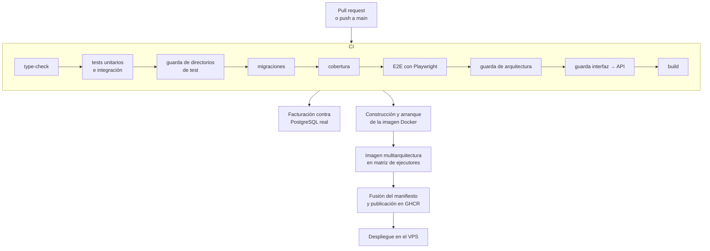

# Despliegue y operación

> 🇬🇧 [English version](./deployment.md)

Todo lo que sigue está contrastado contra `.github/workflows/ci-cd.yml`, `scripts/deploy.sh` y `docker-compose.yml`.

---

## 1. El pipeline

Nueve comprobaciones dentro del trabajo de CI, y tres de ellas no son habituales.

La **guarda de directorios de test** verifica que ningún directorio de tests quede fuera de algún proyecto de vitest. Sin ella, mover un fichero a una carpeta nueva lo saca silenciosamente de la suite y nadie se entera de que dejó de ejecutarse.

La **guarda de arquitectura** ejecuta `dependency-cruiser` más un test negativo que comprueba que las reglas fallan cuando deben fallar. Es una guarda sobre la guarda.

La **guarda de interfaz contra API** contrasta lo que el frontal consume con lo que la API expone, de modo que un contrato roto se detecta en integración y no en producción.

La cobertura, además, se mide contra una base de datos real desde `#417`, no contra una simulada, así que el número refleja lo que de verdad se ejecuta.

## 2. La imagen

La construcción es multiarquitectura sobre una matriz de ejecutores y termina fusionando el manifiesto y publicándolo en GHCR. Antes de eso hay una prueba de humo que construye la imagen, levanta Postgres, ejecuta las migraciones dentro de un contenedor efímero, arranca api y web y comprueba la sonda de salud. Si la aplicación no arranca, no hay imagen.

## 3. El despliegue

El trabajo de despliegue empieza validando que existen todos los secretos necesarios, con un mensaje que incluso indica cómo generar `VPS_KNOWN_HOSTS` con `ssh-keyscan`. Fallar pronto y con una instrucción útil.

Después configura SSH con la huella del host fijada desde `VPS_KNOWN_HOSTS`, en lugar de confiar en el primer uso, copia los ficheros necesarios y ejecuta `scripts/deploy.sh` en el servidor.

La configuración viaja como carga codificada en base64 en lugar de como argumentos de la orden SSH. El motivo está escrito en el script: evitar la inyección a través de la línea de órdenes.

### La precedencia que evita un despliegue verde con imagen antigua

Este es el detalle más interesante de todo el proceso, y responde a un fallo real.

En el VPS hay un `.env` gestionado por el operador que sobrevive a los despliegues y contiene los secretos de ejecución. El script necesita cargarlo para que Compose pueda interpolar `${OPENROUTER_*}` y `${LANGFUSE_*}`. Pero si ese fichero contiene por descuido un `IMAGE_TAG` o un `GHCR_IMAGE` copiado de otro sitio, cargarlo sobrescribiría la imagen que el pipeline acaba de construir.

La solución es tomar una instantánea de las variables gestionadas por el pipeline antes de cargar el `.env` y restaurarlas después. Son la referencia de imagen, las credenciales de OAuth, la URL base de la API y el origen público. Además el script avisa por la salida de error si detecta que el `.env` del operador define alguna de ellas.

Sin esa precedencia, un despliegue podía terminar en verde ejecutando una imagen antigua. Es exactamente el tipo de fallo que no da la cara.

## 4. Reparto de secretos

| Dónde vive | Qué contiene | Quién lo gestiona |
|---|---|---|
| Secretos de GitHub Actions | `VPS_HOST`, `VPS_USER`, `VPS_SSH_KEY`, `VPS_KNOWN_HOSTS`, y opcionalmente `VPS_PORT`, `VPS_DEPLOY_DIR`, `PRODUCTION_BASE_URL` | el pipeline |
| `.env` del operador en el VPS | `OPENROUTER_*`, `LANGFUSE_*`, `DEEPGRAM_*`, `STRIPE_*`, y opcionalmente `POSTGRES_*` | la persona que opera |
| Carga del despliegue | referencia de imagen, OAuth, URL base de la API, origen público | el pipeline, con precedencia |

El `.env` del operador **no lo envía nunca** la integración continua y sobrevive entre despliegues. La separación es intencionada: las credenciales de infraestructura pertenecen al pipeline, las de servicios externos pertenecen a quien opera el servidor.

## 5. La regla de reenvío de Compose

Compose solo inyecta en el contenedor las variables listadas en el bloque `environment:` del servicio. Una variable definida en el `.env` del VPS pero ausente de ese bloque se ignora en silencio y el contenedor se queda con el valor por defecto compilado.

Esto ha provocado fallos reales más de una vez: las variables de Stripe en `#254`, y más tarde las de voz y las de Deepgram. Al documentar la configuración se detectó el mismo patrón pendiente en tres variables de Gemini, que se corrigieron.

La regla operativa es sencilla: al añadir una variable, se añade el reenvío en `docker-compose.yml` en el mismo cambio, y se documenta en `.env.example` y en `apps/api/README.md`.

Hay una excepción documentada. `GOOGLE_TTS_STYLE_DIRECTIVE` **no** se reenvía, porque el sintetizador la resuelve con el operador `??` y Compose interpola una variable no definida como cadena vacía, que no es nula. Reenviarla tal cual sustituiría la directiva de acento castellano por una cadena vacía en cada despliegue que no la definiera. Hacerla configurable en contenedor exige antes que el adaptador trate la cadena vacía como ausencia.

## 6. Base de datos

La imagen es `pgvector/pgvector:pg17` y no es negociable: la migración de memoria vectorial ejecuta `CREATE EXTENSION vector`. Una imagen `postgres:*` sin la extensión falla la migración. Hay tests que verifican que la imagen está fijada de forma coherente en el Compose, en el flujo de CI y en el arrancador de la pila E2E.

Los datos viven en el volumen `postgres-data` de Compose. El servicio no publica puertos: api y web lo alcanzan por la red interna.

## 7. Reversión

Para desactivar la escritura y la recuperación de memoria vectorial sin parar la API basta con dejar `OPENAI_API_KEY` sin valor: la frontera de embeddings falla en abierto y el resto de la generación sigue funcionando. Lo que **no** se debe hacer es quitar `CREATE EXTENSION vector` de la migración ni cambiar la imagen de Postgres.

Cambiar el modelo o la dimensión de embeddings sin re-embeber no rompe nada, pero crea una cohorte incompatible que la recuperación omitirá deliberadamente. Es reversible restaurando los valores anteriores.

Para el resto, la reversión es desplegar la etiqueta anterior de la imagen.

## 8. Observabilidad

Langfuse recoge las trazas de las llamadas al modelo, con la redacción descrita en [la capa de IA](./ai-layer_ES.md). Es opcional: sin credenciales no traza y nada falla.

La tabla `observability_events` guarda los eventos curados del propio sistema, con nivel, evento, resultado y metadatos, consultables desde `/admin/logs`. Los eventos de generación llevan **solo identificadores**, y en caso de fallo el **nombre** del error, nunca el mensaje, la especificación ni el contenido del programa.

Además hay un flujo programado, `seat-reconcile.yml`, que reconcilia las cantidades de asientos con Stripe.
