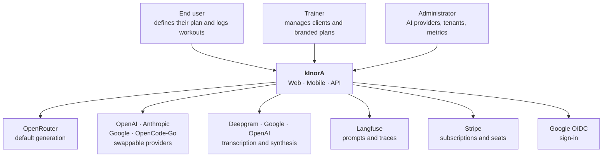
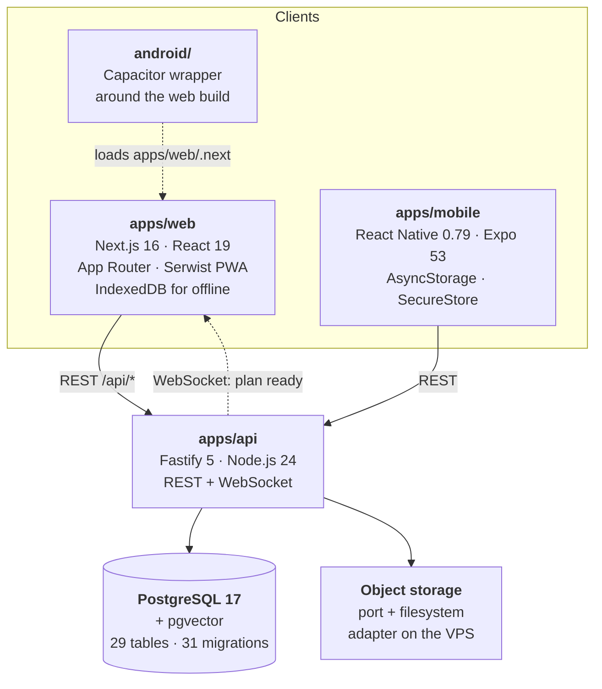
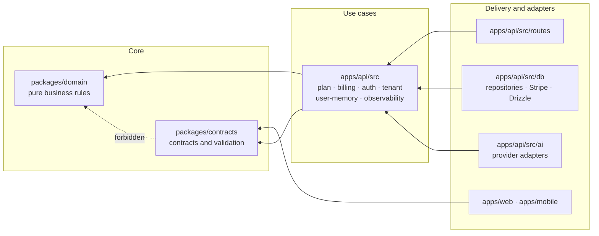
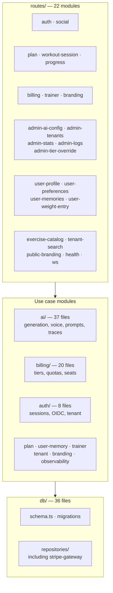
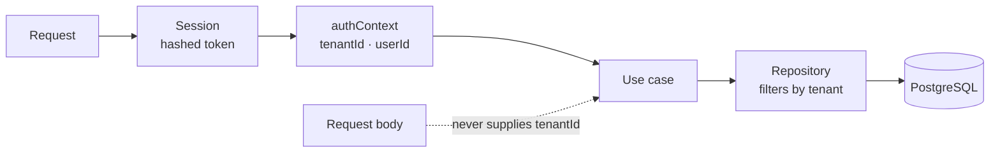
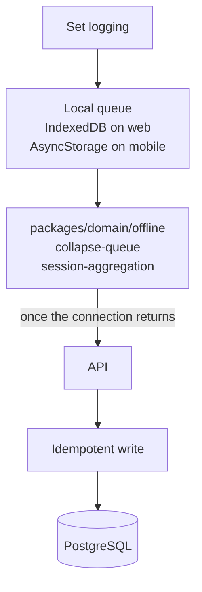

# kInorA Architecture

> 🇪🇸 [Versión en español](./overview_ES.md)

Technical reference document. Everything asserted here has been checked against the code in `origin/main`; the diagrams are Mermaid, so they can be versioned and rendered on GitHub without external tooling.

---

## 1. Context

kInorA is an AI-powered personal training platform. Three kinds of people use it, and eight external systems keep it running.



The decision that defines the system is that **no AI provider is welded to the code**. Generation, transcription and synthesis are all resolved through ports, and switching providers is an operational decision. This is covered in detail in [the AI layer](./ai-layer.md).

---

## 2. Containers



All three client paths share the `@kinora/contracts`, `@kinora/domain` and `@kinora/i18n` packages, so business rules and message catalogues are written exactly once.

Two mobile paths coexist: the native Expo app, which is the primary route, and a Capacitor wrapper that packages the web build. The second one is a leftover from `06-v1-mobile-foundation`, when the strategy was a PWA inside a native shell.

---

## 3. Layers and dependency rules

The architecture is clean, with dependencies pointing inward, and that is not an aspiration written down in a document: it is nine `dependency-cruiser` rules that fail the build.



The rules, exactly as they are written in `.dependency-cruiser.cjs`:

`domain-no-outer-layers` stops the domain from importing apps, infrastructure, frameworks, the database, authentication, payments, AI or Node network modules. `domain-no-outer-npm-deps` and `domain-no-outer-npm-unresolvable` extend the same restriction to npm packages, even when they don't resolve.

`contracts-no-workspace-deps` forbids the contracts package from depending on any other workspace package, which keeps it a leaf of the graph; `contracts-no-db-packages` and `contracts-no-outer-npm-unresolvable` stop the database schema from leaking across the boundary.

`api-no-db-outside-infra` forces everything outside the infrastructure layer to reach data through a repository, never directly. `api-no-stripe-outside-infra` confines the Stripe SDK to a single file, `db/repositories/stripe-gateway.ts`, so that the billing use cases depend on the `StripeGateway` port rather than on the SDK. `routes-no-db-layer` closes the loop: routes depend on an injected port, and `app.ts` is the only composition root that builds repositories.

There is also a negative architecture test, `scripts/architecture-negative-test.mjs`, which verifies that the rules actually fail when they are supposed to fail. It's a guard on the guard: without it, a badly written rule would pass forever and nobody would be any the wiser.

---

## 4. API components



The size of each module says a good deal about where the product's real complexity lives: the AI and billing layers account for fifty-seven of the use case files, while the planner itself is two, because the planning logic lives in `packages/domain`, which is exactly where it belongs.

---

## 5. Plan generation flow

This is the most representative path through the system: it crosses all four layers, talks to two external services, applies a billing gate, queries vector memory and redacts health data before tracing it.

```mermaid
sequenceDiagram
    participant W as Web / Mobile
    participant R as routes/plan.ts
    participant G as PlanGenerationService
    participant B as Billing gate
    participant V as Vector memory
    participant P as Prompt provider
    participant L as LLM adapter
    participant D as PostgreSQL
    participant WS as WebSocket

    W->>R: POST generate plan (planSpecId)
    R->>G: assertGeneratable(tenant, user, spec)
    G->>D: look up confirmed spec
    alt spec missing or unconfirmed
        G-->>R: PlanSpecNotFoundError (404)
    else invalid shape
        G-->>R: PlanSpecShapeError (422)
    end
    Note over R,B: quota is only consumed after validation,<br/>never before
    R->>B: consume unit
    R->>G: startGeneration(...)
    G->>D: create row in "generating" state
    G-->>W: { planId, status: "generating" }

    Note over G,L: from here on, in the background
    G->>B: entitled to premium memory?
    alt granted
        G->>V: retrieve user memories
    else denied
        Note over G,V: skipped before embedding<br/>or searching; a denial is never<br/>treated as a technical failure
    end
    G->>D: profile and body weight series
    G->>P: resolve prompt (production label)
    alt Langfuse responds and validates
        P-->>G: remote template
    else failure, absence or failed validation
        P-->>G: locally compiled template
    end
    G->>L: invoke with JSON schema structured output
    Note over G,L: limitations are masked<br/>before the prompt reaches the trace
    L-->>G: program
    G->>D: markReady / markFailed
    G->>WS: notify the user
```

Four decisions in this flow deserve attention, and the first three are written as comments in the code itself because each one cost an incident or a review.

The response is immediate and generation happens in the background, so the client gets back a `planId` and a `generating` status without waiting on the model. The completion notice travels over WebSocket.

Validation comes before quota consumption. A request against a spec that doesn't exist, isn't confirmed, or has an invalid shape returns 404 or 422 without spending a billing unit.

A billing denial is never confused with a technical failure. If the user isn't entitled to premium memory, retrieval is skipped **before** embedding or searching, rather than letting it fail and treating that as an outage with recovery.

And the prompt provider falls back to the compiled template, not to an error. A Langfuse outage degrades prompt quality, not product availability.

---

## 6. Multi-tenant isolation

The tenant is a system invariant, not just another field. Eighteen of the twenty-nine tables carry `tenant_id`, and the identifier always comes from the authentication context, never from the request body: the service signatures document this explicitly.



Validation is applied at the boundary and again at the persistence access point. The E2E suite includes a dedicated scenario, `plan-cross-tenant.spec.ts`, which attempts cross-tenant access and expects it to fail.

---

## 7. Offline logging

Workout logging works without a connection, which is a real requirement: plenty of gyms have no signal.



The queue collapsing and session aggregation logic lives in `packages/domain/offline`, free of framework dependencies, which makes it testable as a pure function and shareable between web and mobile. The flush was hardened in `09d-v1-offline-flush-hardening`, and the abandoned session has had its own handling since `17b-stale-session-recovery`.

---

## 8. Related documents

The [data model](./data-model.md) covers the twenty-nine tables and their invariants in detail. The [AI layer](./ai-layer.md) goes into ports, providers, remote prompt management and redaction in traces. The [API reference](./api-reference.md) walks through the endpoints and the authentication model. The [deployment guide](./deployment.md) covers the pipeline, secret distribution and rollback.

The [decision catalogue](./decisions.md) distils the more than one hundred and sixty decisions documented across the forty-two archived changes, and draws out the criteria that recur in all of them.
