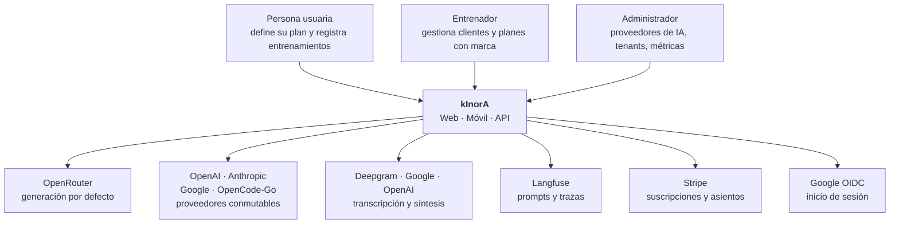
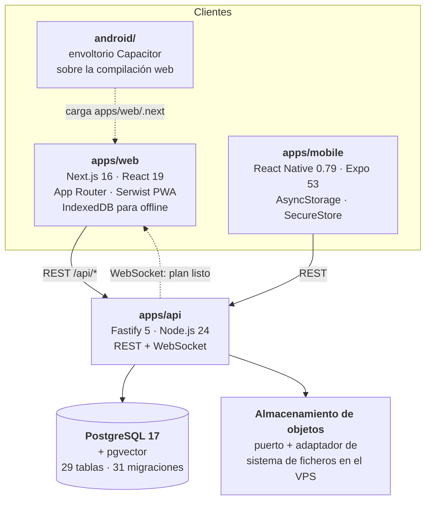
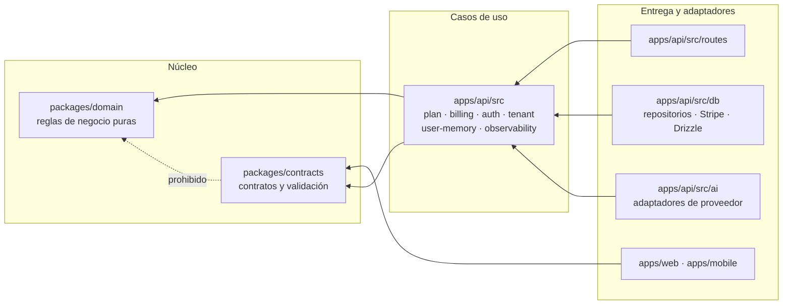
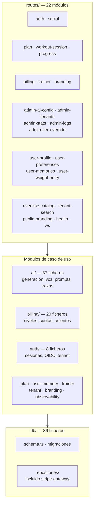
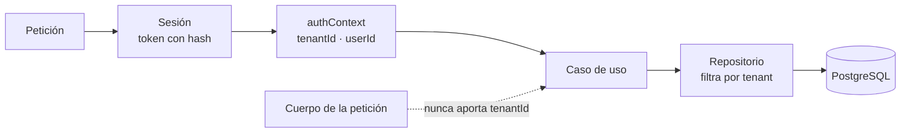
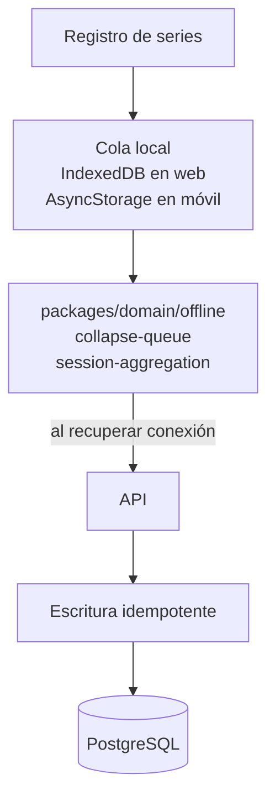

# Arquitectura de kInorA

> 🇬🇧 [English version](./overview.md)

Documento de referencia técnica. Todo lo que aquí se afirma está contrastado contra el código de `origin/main`; los diagramas son Mermaid, versionable y renderizable en GitHub sin herramientas externas.

---

## 1. Contexto

kInorA es una plataforma de entrenamiento personalizado con IA. Tres tipos de persona la usan y ocho sistemas externos la sostienen.



La decisión que define el sistema es que **ninguno de los proveedores de IA está soldado al código**. Generación, transcripción y síntesis se resuelven por puerto, y cambiar de proveedor es una decisión operativa. Esto se detalla en [la capa de IA](./ai-layer_ES.md).

---

## 2. Contenedores



Las tres vías de cliente comparten los paquetes `@kinora/contracts`, `@kinora/domain` e `@kinora/i18n`, de modo que las reglas de negocio y los catálogos de mensajes se escriben una sola vez.

Hay dos caminos móviles conviviendo: la aplicación nativa con Expo, que es la vía principal, y un envoltorio de Capacitor que empaqueta la compilación web. El segundo es herencia de `06-v1-mobile-foundation`, cuando la estrategia era PWA en contenedor nativo.

---

## 3. Capas y reglas de dependencia

La arquitectura es limpia con dependencias apuntando hacia dentro, y eso no es una aspiración escrita en un documento: son nueve reglas de `dependency-cruiser` que fallan la compilación.



Las reglas, tal como están escritas en `.dependency-cruiser.cjs`:

`domain-no-outer-layers` impide que el dominio importe aplicaciones, infraestructura, frameworks, base de datos, autenticación, pagos, IA o módulos de red de Node. `domain-no-outer-npm-deps` y `domain-no-outer-npm-unresolvable` extienden lo mismo a los paquetes npm, incluso cuando no se resuelven.

`contracts-no-workspace-deps` prohíbe que el paquete de contratos dependa de cualquier otro paquete del espacio de trabajo, lo que lo mantiene como hoja del grafo; `contracts-no-db-packages` y `contracts-no-outer-npm-unresolvable` impiden que el esquema de base de datos se filtre a través de la frontera.

`api-no-db-outside-infra` obliga a que todo lo que esté fuera de la capa de infraestructura acceda a datos por repositorio, nunca directamente. `api-no-stripe-outside-infra` restringe el SDK de Stripe a un único fichero, `db/repositories/stripe-gateway.ts`, de modo que los casos de uso de facturación dependen del puerto `StripeGateway` y no del SDK. `routes-no-db-layer` cierra el círculo: las rutas dependen de un puerto inyectado y `app.ts` es la única raíz de composición que construye repositorios.

Hay además un test negativo de arquitectura, `scripts/architecture-negative-test.mjs`, que verifica que las reglas efectivamente fallan cuando deben fallar. Es una guarda sobre la guarda: sin él, una regla mal escrita pasaría siempre y nadie se enteraría.

---

## 4. Componentes de la API



El tamaño de cada módulo dice bastante sobre dónde está la complejidad real del producto: la capa de IA y la de facturación concentran cincuenta y siete de los ficheros de casos de uso, y el planificador propiamente dicho son dos, porque la lógica de planificación vive en `packages/domain`, que es exactamente donde debe estar.

---

## 5. Flujo de generación de un plan

Es el recorrido más representativo del sistema: cruza las cuatro capas, habla con dos servicios externos, aplica una puerta de facturación, consulta memoria vectorial y redacta datos de salud antes de trazarlos.

```mermaid
sequenceDiagram
    participant W as Web / Móvil
    participant R as routes/plan.ts
    participant G as PlanGenerationService
    participant B as Puerta de facturación
    participant V as Memoria vectorial
    participant P as Proveedor de prompts
    participant L as Adaptador LLM
    participant D as PostgreSQL
    participant WS as WebSocket

    W->>R: POST generar plan (planSpecId)
    R->>G: assertGeneratable(tenant, user, spec)
    G->>D: buscar spec confirmada
    alt spec ausente o sin confirmar
        G-->>R: PlanSpecNotFoundError (404)
    else forma inválida
        G-->>R: PlanSpecShapeError (422)
    end
    Note over R,B: la cuota solo se consume tras validar,<br/>nunca antes
    R->>B: consumir unidad
    R->>G: startGeneration(...)
    G->>D: crear fila en estado "generating"
    G-->>W: { planId, status: "generating" }

    Note over G,L: a partir de aquí, en segundo plano
    G->>B: ¿derecho a memoria premium?
    alt concedido
        G->>V: recuperar memorias del usuario
    else denegado
        Note over G,V: se omite antes de embeber<br/>o buscar; una denegación nunca<br/>se usa como fallo técnico
    end
    G->>D: perfil y series de peso corporal
    G->>P: resolver prompt (etiqueta production)
    alt Langfuse responde y valida
        P-->>G: plantilla remota
    else fallo, ausencia o validación fallida
        P-->>G: plantilla compilada local
    end
    G->>L: invocar con salida estructurada por esquema JSON
    Note over G,L: las limitaciones se enmascaran<br/>antes de que el prompt llegue a la traza
    L-->>G: programa
    G->>D: markReady / markFailed
    G->>WS: notificar al usuario
```

Cuatro decisiones de este flujo merecen atención, y las tres primeras están escritas como comentarios en el propio código porque costaron un incidente o una revisión.

La respuesta es inmediata y la generación ocurre en segundo plano, así que el cliente recibe un `planId` y un estado `generating` sin esperar al modelo. El aviso de finalización viaja por WebSocket.

La validación precede al consumo de cuota. Una petición contra una especificación inexistente, sin confirmar o con forma inválida devuelve 404 o 422 sin gastar una unidad de facturación.

Una denegación de facturación no se confunde nunca con un fallo técnico. Si el usuario no tiene derecho a la memoria premium, la recuperación se omite **antes** de embeber o buscar, en lugar de dejar que falle y tratarlo como caída con recuperación.

Y la caída del proveedor de prompts es hacia la plantilla compilada, no hacia el error. Una caída de Langfuse degrada la calidad del prompt, no la disponibilidad del producto.

---

## 6. Aislamiento multi-tenant

El tenant es un invariante del sistema, no un campo más. Dieciocho de las veintinueve tablas llevan `tenant_id`, y el identificador procede siempre del contexto de autenticación, nunca del cuerpo de la petición: las firmas de servicio lo documentan explícitamente.



La validación se aplica en la frontera y otra vez en el acceso a persistencia. La suite E2E incluye un escenario específico, `plan-cross-tenant.spec.ts`, que intenta el acceso cruzado y espera que falle.

---

## 7. Registro offline

El registro de entrenamiento funciona sin conexión, que es un requisito real: en muchos gimnasios no hay cobertura.



La lógica de colapso de cola y de agregación de sesión vive en `packages/domain/offline`, sin dependencias de framework, lo que permite probarla como función pura y compartirla entre web y móvil. El volcado se endureció en `09d-v1-offline-flush-hardening`, y la sesión abandonada tiene su propio tratamiento desde `17b-stale-session-recovery`.

---

## 8. Documentos relacionados

El [modelo de datos](./data-model_ES.md) detalla las veintinueve tablas y sus invariantes. La [capa de IA](./ai-layer_ES.md) desarrolla puertos, proveedores, gestión remota de prompts y redacción en trazas. La [referencia de API](./api-reference_ES.md) recorre los endpoints y el modelo de autenticación. La [guía de despliegue](./deployment_ES.md) cubre el pipeline, el reparto de secretos y la reversión.

El [catálogo de decisiones](./decisions_ES.md) destila las más de ciento sesenta decisiones documentadas en los cuarenta y dos cambios archivados, y extrae los criterios que se repiten en todas ellas.
