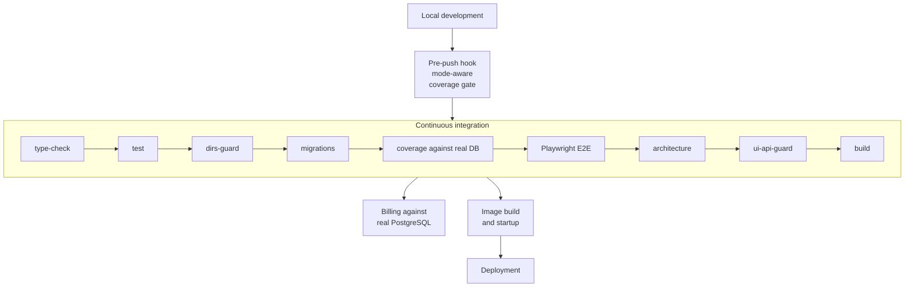

# Quality and automated guards

> 🇪🇸 [Versión en español](./quality-and-guards_ES.md)

Delegating volume to agents without an automated net is delegating risk. This document describes the net: what it checks, where it runs and why it is designed the way it is.

---

## 1. The TDD contract

`AGENTS.md` states it as an obligation, not a recommendation: first a failing test for the new behaviour, then the minimal implementation that makes it pass, and then the edge cases — empty, invalid, boundary, error, permission, offline, tenant isolation and regression — in what the project calls the Triangle phase.

Two rules close off the usual escape routes. Coverage must stay at 80% or above, and new code must meet or beat it. And nothing gets marked as done if there are missing, skipped, flaky or manually-verified-only tests.

The measured result on `origin/main`: **491 test files against 502 code files**. Practically one to one. Of those, 26 are integration suites and 13 are end-to-end Playwright scenarios.

---

## 2. The seven guards

| Guard | What it prevents |
|---|---|
| `type-check` | Type errors across all workspaces |
| `test` | Behavioural regressions |
| `architecture` | Layer boundary violations, negative test included |
| `deps-guard` | Forbidden dependencies outside their allowed workspaces |
| `ui-api-guard` | Drift between what the interface consumes and what the API exposes |
| `build` | Bundling errors that neither types nor tests catch |
| `test:dirs-guard` | Test directories that belong to no vitest project |

The last two deserve an explanation because they are not common.

The **build guard** is in the contract for a specific reason: the Next compilation catches bundling errors — such as server code leaking into a client component — that type checking, tests and the architecture check do **not** detect. It is a class of failure that only shows up at build time.

The **test directory guard** solves a silent problem: if someone moves a test file into a folder that no vitest project includes, that test stops running and nobody notices. The indicator stays green, coverage drops a little and the cause is invisible. The guard fails if any test directory is left orphaned.

To this is added the **negative architecture test**, which checks that the dependency rules fail when they ought to fail. It is a guard on the guard: without it, a badly written rule would always pass.

---

## 3. The coverage gate, and why it has two floors

This is the best-designed piece of the quality system, and its reasoning applies well beyond this project.

The problem: the API integration suites are conditional on a database being available. A local run without a database skips them all and reports about three points less function coverage than the same revision in continuous integration. With a single floor, you had to derive it from the lower number, which left unprotected the three points that continuous integration does demonstrate.

The solution was to make the gate mode-aware. With a reachable database, the twenty integration suites run and the integrated floor applies. Without one, they are skipped and the floor that an infrastructure-free run can honestly demonstrate applies instead. The script announces out loud which of the two is in effect before it starts.

The numbers are measured and annotated with their revision and their continuous integration run: **94.35%** function coverage in integrated mode and **91.51%** in hermetic mode. The floors are set at 93 and 90 respectively, leaving a little over a point of headroom for variation in each case, with the explicit criterion that the margin be a decision and not *"whatever the last run happened to report"*.

And the principle governing the whole design is written into the hook itself, and it is one of the best lines in the entire repository:

> *"A gate that can only be satisfied by infrastructure the project does not help you obtain is a gate people learn to skip."*

A gate that people learn to skip is worse than no gate at all, because on top of everything it grants false confidence. Hence the derived rule: the hook must never fail for a reason the developer cannot act on locally, which is why an unreachable database degrades the mode — saying so out loud — instead of erroring out.

### The threshold that surprises

The shared configuration sets the global bar at 80% statements, 80% branches and 80% lines, but **100% functions**, with a note that every exported function must be covered and that the per-package adjustments exist for framework glue.

Requiring total function coverage is stricter than the nominal 80% and catches a specific class of oversight: the function that gets written, gets exported and is never called from any test.

---

## 4. Where each thing runs

Coverage in continuous integration is measured **against a real database** as of change `#417`, not against a simulated one, so that the number reflects what actually runs.

---

## 5. What all this buys

With 173 pull requests in 52 days and an average of twelve files per pull request, the person doing the reviewing cannot hold all of the correctness in their head. The guards do not replace that review: they free it up.

A reviewer who knows that the types compile, that the architectural boundaries are respected, that no forbidden dependency has slipped in, that the interface and the API still agree, that the application builds and that coverage has not dropped can spend their attention on the one thing no machine checks: **whether the change does the thing that needs doing**.

That division of labour is what makes the volume viable. Without it, either you review little and debt gets in, or you review everything and the volume disappears.
