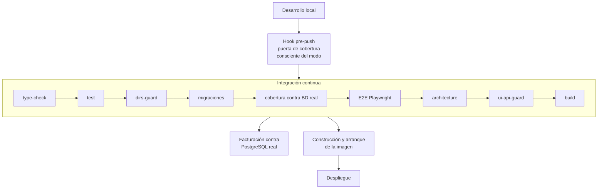

# Calidad y guardas automáticas

> 🇬🇧 [English version](./quality-and-guards.md)

Delegar volumen en agentes sin una red automática es delegar riesgo. Este documento describe la red: qué comprueba, dónde se ejecuta y por qué está diseñada así.

---

## 1. El contrato de TDD

`AGENTS.md` lo fija como obligación, no como recomendación: primero un test que falla para el comportamiento nuevo, después la implementación mínima que lo hace pasar, y después los casos límite —vacío, inválido, frontera, error, permiso, offline, aislamiento de tenant y regresión— en lo que el proyecto llama la fase Triangle.

Dos reglas cierran las salidas habituales. La cobertura debe mantenerse en el 80 % o por encima, y el código nuevo debe alcanzarlo o superarlo. Y no se marca nada como terminado si hay tests ausentes, omitidos, inestables o verificados solo a mano.

El resultado medido sobre `origin/main`: **491 ficheros de test frente a 502 ficheros de código**. Prácticamente uno a uno. De ellos, 26 son suites de integración y 13 escenarios extremo a extremo con Playwright.

---

## 2. Las siete guardas

| Guarda | Qué impide |
|---|---|
| `type-check` | Errores de tipo en todos los espacios de trabajo |
| `test` | Regresiones de comportamiento |
| `architecture` | Violaciones de las fronteras de capa, con test negativo incluido |
| `deps-guard` | Dependencias prohibidas fuera de sus espacios permitidos |
| `ui-api-guard` | Deriva entre lo que la interfaz consume y lo que la API expone |
| `build` | Errores de empaquetado que ni los tipos ni los tests detectan |
| `test:dirs-guard` | Directorios de tests que no pertenecen a ningún proyecto de vitest |

Las dos últimas merecen explicación porque no son habituales.

La **guarda de construcción** está en el contrato con un motivo concreto: la compilación de Next captura errores de empaquetado, como código de servidor colándose en un componente de cliente, que la verificación de tipos, los tests y la comprobación de arquitectura **no** detectan. Es una clase de fallo que solo aparece al construir.

La **guarda de directorios de test** resuelve un problema silencioso: si alguien mueve un fichero de test a una carpeta que ningún proyecto de vitest incluye, ese test deja de ejecutarse y nadie se entera. El indicador sigue verde, la cobertura baja un poco y la causa es invisible. La guarda falla si algún directorio de tests queda huérfano.

A esto se añade el **test negativo de arquitectura**, que comprueba que las reglas de dependencias fallan cuando deben fallar. Es una guarda sobre la guarda: sin ella, una regla mal escrita pasaría siempre.

---

## 3. La puerta de cobertura, y por qué tiene dos suelos

Esta es la pieza mejor diseñada del sistema de calidad, y su razonamiento es aplicable muy fuera de este proyecto.

El problema: las suites de integración de la API están condicionadas a que exista una base de datos. Una ejecución local sin base de datos las omite todas y reporta unos tres puntos menos de cobertura de funciones que la misma revisión en integración continua. Con un único suelo, había que derivarlo del número más bajo, lo que dejaba sin proteger los tres puntos que la integración continua sí demuestra.

La solución fue hacer la puerta consciente del modo. Con base de datos alcanzable, se ejecutan las veinte suites de integración y se aplica el suelo integrado. Sin ella, se omiten y se aplica el suelo que una ejecución sin infraestructura puede demostrar honestamente. El script anuncia en voz alta cuál de los dos aplica antes de empezar.

Los números están medidos y anotados con su revisión y su ejecución de integración continua: **94,35 %** de cobertura de funciones en modo integrado y **91,51 %** en modo hermético. Los suelos se fijan en 93 y 90 respectivamente, dejando en cada caso poco más de un punto de margen para variación, con el criterio explícito de que el margen sea una decisión y no *«whatever the last run happened to report»*.

Y el principio que gobierna todo el diseño está escrito en el propio hook, y es una de las mejores frases de todo el repositorio:

> *«A gate that can only be satisfied by infrastructure the project does not help you obtain is a gate people learn to skip.»*

Una puerta que la gente aprende a saltarse es peor que no tener puerta, porque además da falsa confianza. De ahí la regla derivada: el hook nunca debe fallar por un motivo sobre el que quien desarrolla no pueda actuar en local, y por eso una base de datos inalcanzable degrada el modo —diciéndolo— en lugar de dar error.

### El umbral que sorprende

La configuración compartida fija el listón global en 80 % de sentencias, 80 % de ramas y 80 % de líneas, pero **100 % de funciones**, con la anotación de que toda función exportada debe estar cubierta y que los ajustes por paquete existen para el pegamento de framework.

Exigir cobertura total de funciones es más estricto que el 80 % nominal y captura una clase concreta de descuido: la función que se escribe, se exporta y nunca se llama desde ningún test.

---

## 4. Dónde se ejecuta cada cosa

La cobertura en integración continua se mide **contra una base de datos real** desde el cambio `#417`, no contra una simulada, de modo que el número refleja lo que de verdad se ejecuta.

---

## 5. Qué compra todo esto

Con 173 pull requests en 52 días y una media de doce ficheros por pull request, la persona que revisa no puede sostener toda la corrección en la cabeza. Las guardas no sustituyen esa revisión: la liberan.

Un revisor que sabe que los tipos compilan, que las fronteras de arquitectura se respetan, que ninguna dependencia prohibida se ha colado, que la interfaz y la API siguen de acuerdo, que la aplicación construye y que la cobertura no ha bajado, puede dedicar su atención a lo único que una máquina no comprueba: **si el cambio hace lo que hay que hacer**.

Ese reparto es lo que hace viable el volumen. Sin él, o se revisa poco y entra deuda, o se revisa todo y el volumen desaparece.
