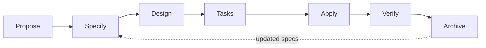

# The spec-driven development cycle

> 🇪🇸 [Versión en español](./sdd-cycle_ES.md)

kInorA was not built by writing code and documenting it afterwards. It was built with a seven-phase cycle in which code is the sixth phase, and every phase leaves a versioned artifact behind.

This document traces that cycle over a real case, with its real files and their real sizes.

---

## 1. The seven phases

**Propose** clarifies the business problem, the users affected, the scope, what is left out and the trade-offs. **Specify** defines observable requirements and scenarios with Given/When/Then and RFC 2119 keywords. **Design** describes architecture, boundaries, risks, data flow and — mandatorily — the alternatives that were rejected. **Tasks** breaks the work into reviewable units, each with its verification. **Apply** implements only what was approved. **Verify** demonstrates the behaviour against the specification. **Archive** closes the change with its audit trail and updates the specifications that serve as the source of truth.

The rule is written into the project contract with no way out: you do not skip a phase because a change looks easy. The only admitted exception is atomic maintenance that alters no behaviour, architecture, contract, security, persistence or public interface — and even then you have to justify why.

---

## 2. A complete case

`17c-profile-body-metrics` added a profile with body metrics, a weight time series and volume adjusted by body weight. It closed on 8 August 2026. Its archive folder holds **2,909 lines**, broken down like this:

| Artifact | Lines | What it contains |
|---|---:|---|
| `design.md` | 776 | Decisions with the alternatives that were discarded |
| `tasks.md` | 606 | Breakdown into units with verification |
| `specs/profile-body-metrics/spec.md` | 358 | Requirements and scenarios for the new capability |
| `proposal.md` | 335 | Problem, scope and non-goals |
| `verify-report.md` | 260 | Requirement-by-requirement proof of compliance |
| `archive-report.md` | 231 | Closure, caveats and outstanding work |
| `exploration.md` | 158 | Advance reconnaissance of the terrain |

Plus three **modified** specification files belonging to other capabilities, because a change that touches plan generation, the progress dashboard and structured memory has to update their contracts.

### Exploration, the phase nobody documents

Before anything gets proposed there is a reconnaissance document, and its contents explain why it exists. Its sections are: verification of what the issue claims; the write path for a profile field, "seven layers, and one fix"; the fact that **the mobile app had no profile screen at all**; that the weight series "has a completely different shape"; confirmation that volume by body weight "will rewrite history"; and privacy, under a heading titled "the channel the issue doesn't see".

In other words: exploration found that the original issue was incomplete on four counts, and put that in writing before proposing anything. That is the difference between planning and guessing.

### The verification report proves, it doesn't assert

Its sections are not a summary saying everything is fine. They walk through requirement-by-requirement compliance for the four affected capabilities, and then devote sections to concrete checks: that the three mechanisms of the privacy boundary exist, are wired up and are tested; that degradation is byte-for-byte identical when there is no data; that body data appears in no output schema; that it appears in no observability event; that personal records do not change; and that the four volume surfaces and the three calculation points converge on a single resolved number.

One section per invariant, each with its proof. That is what a committee can audit.

### The archive report says what went wrong

And here is the part that lends credibility to everything else. The "Known Caveats" section of the `17c` closure records three caveats: an operational gap because the remote prompt template was never updated, an issue **closed with the defect unfixed**, and a drift between the specification and the actual values of an enumeration.

Closing a change with a written record of what remains broken is the opposite of what most projects do. It is also what turns the archive into a reliable source rather than propaganda.

---

## 3. The specification is the source of truth, and it is updated at closure

`openspec/specs/` holds forty-four live specifications. `openspec/changes/archive/` holds forty-two closed changes with their full history.

The distinction matters. The specifications say **what the system is today**; the archive says **how it got that way**. When a change closes, its deltas are folded into the live specifications and the change folder is archived with a date. That is why every folder name leads with the date: `2026-08-08-17c-profile-body-metrics`.

The cumulative effect is 286 markdown documents under `openspec/`, which is where most of the project's documentation lives.

---

## 4. Unit size

The configuration sets the bar: tasks must be completable in a single session, with a rough ceiling of two hundred changed lines.

Measured reality over the last sixty merged pull requests gives an average of **12.5 files per pull request**. With 173 pull requests in 52 days, that works out to a little over three a calendar day.

That granularity is not an aesthetic choice. It is what makes it possible for a person to genuinely review what an agent writes — the condition without which the whole method collapses.

---

## 5. Why this cycle and not another

The honest answer is that a cycle like this would be overkill for a project of this size built by hand. With 318,000 lines written in seven weeks, it is not.

The bottleneck when you delegate volume to agents is not writing code: it is **knowing what code to ask for and checking that what arrives is the right thing**. The five phases surrounding "apply" are exactly that. Exploration keeps you from building on a false premise. The specification gives you an acceptance criterion that does not depend on anyone's memory. Design forces you to close off alternatives before writing. Verification proves the work against the criterion. And the archive puts the debt on record.

Without that scaffolding, delegating volume produces volume. With it, it produces a product.
