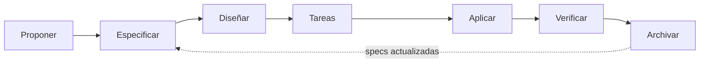

# El ciclo de desarrollo dirigido por especificación

> 🇬🇧 [English version](./sdd-cycle.md)

kInorA no se construyó escribiendo código y documentándolo después. Se construyó con un ciclo de siete fases en el que el código es la sexta, y cada una deja un artefacto versionado.

Este documento traza ese ciclo sobre un caso real, con sus ficheros y sus tamaños reales.

---

## 1. Las siete fases

**Proponer** aclara el problema de negocio, los usuarios afectados, el alcance, lo que queda fuera y las concesiones. **Especificar** define requisitos observables y escenarios con Given/When/Then y palabras clave RFC 2119. **Diseñar** describe arquitectura, fronteras, riesgos, flujo de datos y, obligatoriamente, las alternativas rechazadas. **Tareas** descompone en unidades revisables con su verificación. **Aplicar** implementa solo lo aprobado. **Verificar** demuestra el comportamiento contra la especificación. **Archivar** cierra el cambio con su rastro de auditoría y actualiza las especificaciones que son fuente de verdad.

La regla está escrita sin escapatoria en el contrato del proyecto: no se salta una fase porque un cambio parezca fácil. La única excepción admitida es el mantenimiento atómico que no altera comportamiento, arquitectura, contratos, seguridad, persistencia ni interfaz pública, y aun así hay que justificar por qué.

---

## 2. Un caso completo

`17c-profile-body-metrics` añadió perfil con métricas corporales, serie temporal de peso y volumen ajustado por peso corporal. Cerró el 8 de agosto de 2026. Su carpeta de archivo contiene **2.909 líneas** repartidas así:

| Artefacto | Líneas | Qué contiene |
|---|---:|---|
| `design.md` | 776 | Decisiones con sus alternativas descartadas |
| `tasks.md` | 606 | Descomposición en unidades con verificación |
| `specs/profile-body-metrics/spec.md` | 358 | Requisitos y escenarios de la capacidad nueva |
| `proposal.md` | 335 | Problema, alcance y no-objetivos |
| `verify-report.md` | 260 | Prueba de cumplimiento requisito a requisito |
| `archive-report.md` | 231 | Cierre, salvedades y trabajo pendiente |
| `exploration.md` | 158 | Reconocimiento previo del terreno |

Más tres ficheros de especificación **modificados** de otras capacidades, porque un cambio que toca la generación de planes, el panel de progreso y la memoria estructurada tiene que actualizar sus contratos.

### La exploración, que es la fase que nadie documenta

Antes de proponer nada hay un documento de reconocimiento, y su contenido explica por qué existe. Sus secciones son: verificación de lo que el issue afirma, el camino de escritura de un campo de perfil «siete capas, y una corrección», el hecho de que **la aplicación móvil no tenía pantalla de perfil en absoluto**, que la serie de pesos «tiene una forma completamente distinta», la confirmación de que el volumen por peso corporal «reescribirá el historial», y la privacidad, con un apartado titulado «el canal que el issue no ve».

Es decir: la exploración encontró que el issue original estaba incompleto en cuatro puntos, y lo dejó escrito antes de proponer. Esa es la diferencia entre planificar y adivinar.

### El informe de verificación demuestra, no declara

Sus secciones no son un resumen de que todo va bien. Recorren el cumplimiento requisito a requisito de las cuatro capacidades afectadas, y luego dedican apartados a comprobaciones concretas: que los tres mecanismos de la frontera de privacidad existen, están cableados y están probados; que la degradación es idéntica byte a byte cuando no hay datos; que los datos corporales no aparecen en ningún esquema de salida; que no aparecen en ningún evento de observabilidad; que los récords personales no cambian; y que las cuatro superficies de volumen y los tres puntos de cálculo convergen en un único número resuelto.

Un apartado por invariante, con su prueba. Eso es lo que un tribunal puede auditar.

### El informe de archivo dice lo que salió mal

Y aquí está la parte que da credibilidad al resto. La sección «Known Caveats» del cierre de `17c` recoge tres salvedades: un hueco operativo porque la plantilla remota de prompt no se actualizó, un issue **cerrado con el defecto sin arreglar**, y una deriva entre la especificación y los valores reales de una enumeración.

Cerrar un cambio dejando escrito lo que queda roto es lo contrario de lo que hace la mayoría de los proyectos. Es también lo que convierte el archivo en una fuente fiable en lugar de en propaganda.

---

## 3. La especificación es la fuente de verdad, y se actualiza al cerrar

`openspec/specs/` contiene cuarenta y cuatro especificaciones vigentes. `openspec/changes/archive/` contiene cuarenta y dos cambios cerrados con su historia completa.

La distinción importa. Las especificaciones dicen **cómo es el sistema hoy**; el archivo dice **cómo llegó a serlo**. Cuando un cambio se cierra, sus deltas se integran en las especificaciones vigentes y la carpeta de cambio se archiva con fecha. Por eso el nombre de cada carpeta lleva la fecha delante: `2026-08-08-17c-profile-body-metrics`.

El efecto acumulado son 286 documentos markdown en `openspec/`, que es donde vive la mayor parte de la documentación del proyecto.

---

## 4. Tamaño de unidad

La configuración fija el listón: las tareas deben ser completables en una sesión, con un máximo aproximado de doscientas líneas de cambio.

La realidad medida sobre los últimos sesenta pull requests integrados da una media de **12,5 ficheros por pull request**. Con 173 pull requests en 52 días, sale a algo más de tres por día de calendario.

Esa granularidad no es estética. Es lo que hace posible que una persona revise de verdad lo que un agente escribe, que es la condición sin la cual todo el método se derrumba.

---

## 5. Por qué este ciclo y no otro

La respuesta honesta es que un ciclo así sería excesivo para un proyecto de este tamaño hecho a mano. Con 318.000 líneas escritas en siete semanas, no lo es.

El cuello de botella cuando se delega volumen en agentes no es escribir código: es **saber qué código pedir y comprobar que el que llega es el correcto**. Las cinco fases que rodean a «aplicar» son exactamente eso. La exploración evita construir sobre una premisa falsa. La especificación da un criterio de aceptación que no depende de la memoria de nadie. El diseño obliga a cerrar alternativas antes de escribir. La verificación demuestra contra el criterio. Y el archivo deja constancia de la deuda.

Sin ese andamiaje, delegar volumen produce volumen. Con él, produce producto.
